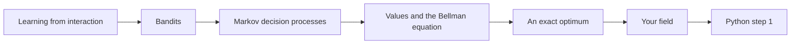
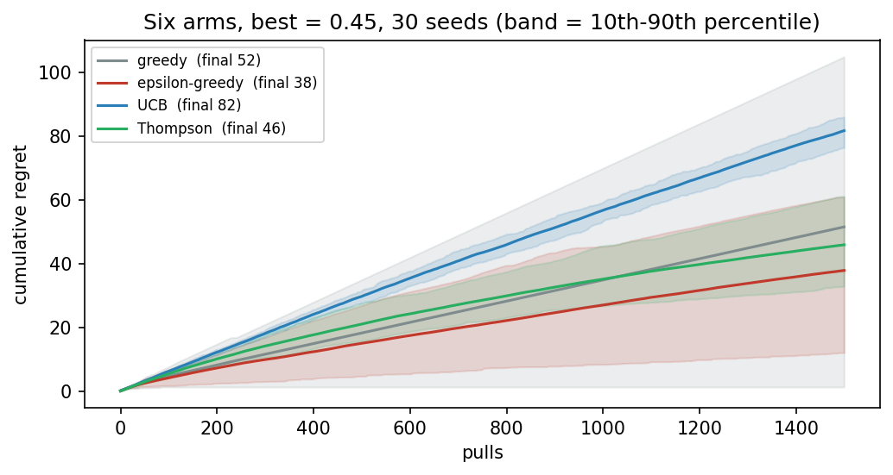
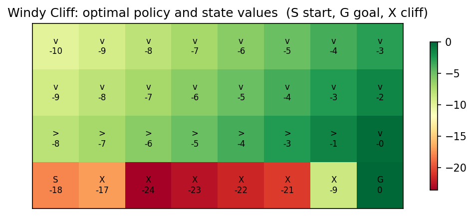
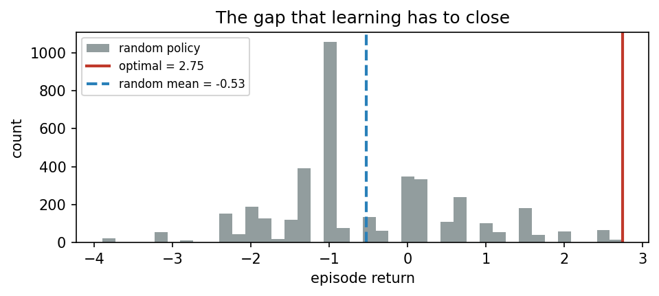
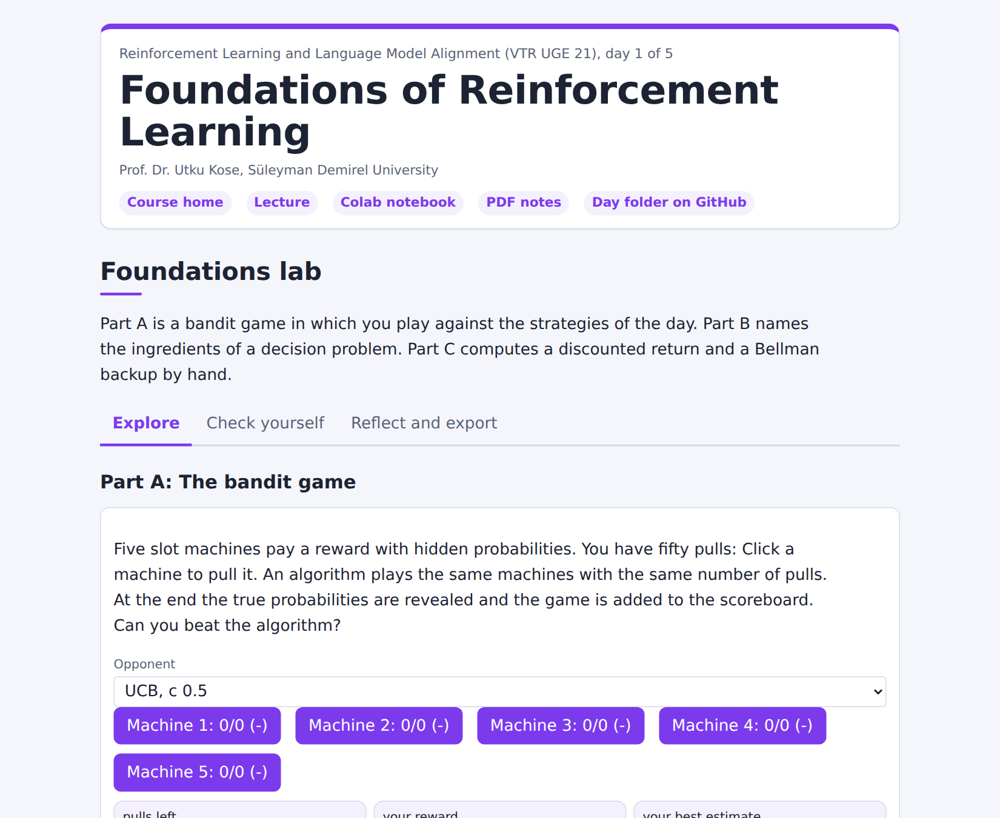
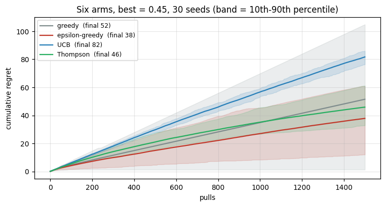
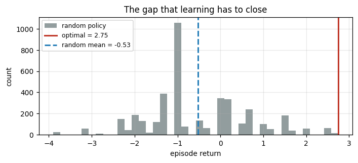

<div align="center">

# Day 01: Foundations of Reinforcement Learning

**Reinforcement Learning and Language Model Alignment (VTR UGE 21)**  
Prof. Dr. Utku Kose, Süleyman Demirel University

[](https://colab.research.google.com/github/utkukose/rl-alignment-veltech-NB-lecture/blob/main/days/day-01/NB01_foundations_of_rl.ipynb) [](https://utkukose.github.io/rl-alignment-veltech-NB-lecture/days/day-01/lab.html) [](https://utkukose.github.io/rl-alignment-veltech-NB-lecture/days/day-01/lecture.html) [](Day01_Lecture_Notes.pdf)

</div>

## Overview

Reinforcement learning is learning from interaction: An agent acts, the environment answers with a new situation and a reward, and the agent improves its behaviour to collect more reward over time [1]. The same idea trains game-playing programs, controls robots and, as Days 4 and 5 show, aligns language models with human preferences. This day introduces the vocabulary of the field on small problems: bandits, where the only question is which action to try [2, 3]; Markov decision processes, where actions also change the situation [1]; and values with the Bellman equation [4], which allow a small world to be solved exactly. That exact solution becomes the yardstick for every method of the week.

**Estimated study time:** 6 to 8 hours.

## Learning outcomes

By the end of the day, students are expected to describe the agent-environment interface and state three ways in which the reward hypothesis can fail, to implement and compare epsilon-greedy, UCB and Thompson sampling by cumulative regret over many seeds, to formulate sequence generation as a Markov decision process, to write the Bellman expectation and optimality equations and solve small processes with policy and value iteration, to obtain the exact optimum of TokenWorld as a reference for later days, and to report a stochastic experiment with seeds, spread and sample size. In Python, students are expected to use values, variables, lists, loops, decisions, functions and dictionaries to simulate and score a bandit.

## Python in this day

The lecture ends with Python step 1: Values, variables, lists and decisions. It covers values and types, lists, `if` statements, `for` loops, functions and dictionaries, applied to a three-armed bandit played with epsilon-greedy and scored by its regret [5]. The hands-on part of the notebook opens with the same step as runnable cells and continues with the full bandit comparison and the two exact solutions. Students who have never programmed should first open the start-here notebook of the course.

## Live session plan

The day runs as one synchronous session in class or online. The plan below is the default timing, and the same materials serve self-paced study through the study path that follows.

| Time | Activity |
|---|---|
| 0:00 to 0:15 | Opening: Five slot machines, played by the class against an algorithm in the lab |
| 0:15 to 0:50 | Lecture part 1: The interface, the reward hypothesis and bandits, with the regret animation |
| 0:50 to 1:15 | Python step 1 together, ending with the regret of a bandit computed by hand |
| 1:15 to 1:25 | Break |
| 1:25 to 2:00 | Lecture part 2: Markov decision processes and the Bellman equations, with the value-iteration animation |
| 2:00 to 2:40 | Hands-on: Notebook sections 1 to 6 in pairs, ending with the exact optimum of TokenWorld |
| 2:40 to 3:00 | Experimental methodology, discussion and self-assessment |

## Study path

| Step | Activity | Suggested time |
|---|---|---|
| 1 | Read the lecture with its animations on the [lecture page](https://utkukose.github.io/rl-alignment-veltech-NB-lecture/days/day-01/lecture.html), or read the [PDF version](Day01_Lecture_Notes.pdf) | 1 hour 30 minutes |
| 2 | Explore the [interactive lab](https://utkukose.github.io/rl-alignment-veltech-NB-lecture/days/day-01/lab.html) | 45 minutes |
| 3 | Study the Python step at the end of the lecture, then run the same step at the start of the hands-on part of the [Colab notebook](https://colab.research.google.com/github/utkukose/rl-alignment-veltech-NB-lecture/blob/main/days/day-01/NB01_foundations_of_rl.ipynb) | 1 hour |
| 4 | Work through the rest of the notebook, including its exercises | 2 hours |
| 5 | Solve the application challenge of your field | 45 minutes |
| 6 | Take the self-assessment in the lab (tab: Check yourself) | 20 minutes |
| 7 | Write the reflection, export the learning log and complete the daily task | 45 minutes |

## Day at a glance



## Lecture

### Learning from interaction

In supervised learning, every example comes with the right answer. In reinforcement learning, nobody gives the right action; the agent only receives a reward after acting, and the reward may come much later than the action that earned it [1]. The agent and the environment exchange three things in a loop: The environment shows a state, the agent chooses an action, and the environment returns a reward and the next state. The behaviour of the agent, the rule that maps states to actions, is called its policy, and its goal is to maximise the total reward over time, called the return.

**Check your understanding.** What does a reinforcement learning agent receive that tells it how well it acted?

A. The correct action
B. A reward, possibly long after the action
C. A label for each state
D. The model of the environment

<details><summary>Answer</summary>

**B.** Rewards are the only feedback, and they may be delayed.

</details>

### Bandits: exploration against exploitation

The simplest problem has one state and several actions, like a row of slot machines, each paying with an unknown probability: a multi-armed bandit. The agent must balance exploitation, choosing the arm that looks best now, with exploration, trying other arms that might be better. A greedy agent never explores and can lock onto a poor arm. An epsilon-greedy agent explores at random a small share of the time. Upper confidence bounds give a bonus to arms that have been tried rarely [2], and Thompson sampling chooses each arm with the probability that it is the best [3]. The price of learning is measured by regret, the reward lost compared with always choosing the best arm. Part A of the lab lets you play against these strategies.

*Animation on the [lecture page](https://utkukose.github.io/rl-alignment-veltech-NB-lecture/days/day-01/lecture.html): Mean cumulative regret of three strategies over 1500 pulls and twenty seeds. Change epsilon and the UCB constant and watch the ranking.*

<p align="center"></p>

*Figure. Cumulative regret of four strategies on six close arms, with the band between the 10th and 90th percentile over thirty seeds.*

> [](https://colab.research.google.com/github/utkukose/rl-alignment-veltech-NB-lecture/blob/main/days/day-01/NB01_foundations_of_rl.ipynb#scrollTo=sec-1) **In Colab, section 1.** Run four strategies on six close arms over thirty seeds and compare their regret and its spread.

**Check your understanding.** Why can a purely greedy strategy end with a large regret?

A. It explores too much
B. It can lock onto a poor arm after a few unlucky early results
C. It is too slow
D. It needs a model

<details><summary>Answer</summary>

**B.** Without exploration, an early wrong impression is never corrected.

</details>

### Markov decision processes

In most problems an action also changes the situation. A Markov decision process describes such a problem with states, actions, transition probabilities, rewards and a discount factor that makes rewards in the near future count more than distant ones [1]. The Markov property says that the next state depends only on the current state and action, not on the whole history. The course uses TokenWorld, a small world in which the agent writes a short sentence one word at a time and is rewarded at the end for its quality. It is a miniature of how a language model is trained with reinforcement learning on Day 4.

> [](https://colab.research.google.com/github/utkukose/rl-alignment-veltech-NB-lecture/blob/main/days/day-01/NB01_foundations_of_rl.ipynb#scrollTo=sec-2) **In Colab, section 2.** Build TokenWorld as a decision process and count its states.

**Check your understanding.** What does the discount factor control?

A. The number of actions
B. How much distant rewards count compared with near ones
C. The learning rate
D. The exploration

<details><summary>Answer</summary>

**B.** A discount below one makes rewards count less the later they come.

</details>

### Values and the Bellman equation

The value of a state is the return the agent can expect from it when following its policy. Bellman observed that values satisfy a recursive relation: The value of a state equals the expected reward of the next step plus the discounted value of the state that follows [4]. When the transitions are known, this relation can be solved by repeating it until the values stop changing, which is value iteration, a form of dynamic programming. On the Windy Cliff, a gridworld in which the wind sometimes pushes the agent sideways towards a cliff, the optimal policy keeps a safe distance from the edge. Part C of the lab computes a return and a Bellman backup by hand.

$$
V^*(s) = \max_a \sum_{s'} P(s' \mid s, a)\,\left[ r(s, a, s') + \gamma V^*(s') \right]
$$

*Animation on the [lecture page](https://utkukose.github.io/rl-alignment-veltech-NB-lecture/days/day-01/lecture.html): Value iteration on the Windy Cliff, sweep by sweep. Change the slip probability and run again; the arrows show the greedy policy.*

<p align="center"></p>

*Figure. The optimal policy and the state values of the Windy Cliff with a slip probability of 0.15.*

> [](https://colab.research.google.com/github/utkukose/rl-alignment-veltech-NB-lecture/blob/main/days/day-01/NB01_foundations_of_rl.ipynb#scrollTo=sec-3) **In Colab, section 3.** Solve the Windy Cliff with value iteration and draw its optimal policy for two wind strengths.

**Check your understanding.** Why does the optimal policy of the Windy Cliff keep away from the edge?

A. The edge has no reward
B. The wind may push it into the cliff, which costs much more than a few extra steps
C. It is random
D. Value iteration failed

<details><summary>Answer</summary>

**B.** The expected cost of a slip into the cliff outweighs the cost of a longer path.

</details>

### An exact optimum as a yardstick

TokenWorld is small enough to be solved exactly by enumerating every sentence. The best policy earns a return of 2.75, while a policy that picks words at random earns about minus 0.49 on average and reaches the optimum less than once in two hundred tries. Every learning method of the week is measured against this exact optimum, which turns a vague claim that a method works into a number.

<p align="center"></p>

*Figure. Returns of 4000 rollouts of the random policy, with its mean and the exact optimum.*

> [](https://colab.research.google.com/github/utkukose/rl-alignment-veltech-NB-lecture/blob/main/days/day-01/NB01_foundations_of_rl.ipynb#scrollTo=sec-4) **In Colab, section 4.** Compute the exact optimum of TokenWorld and the return of the random policy, exactly and by simulation.

### Your field

Bandits appear wherever options are tested on the fly: doses in a clinical trial, subject lines of an email campaign, tariffs offered to drivers, irrigation schedules or hint styles in a tutoring system. The notebook's switch loads four options from one of these fields and runs the four strategies of the day on them.

> [](https://colab.research.google.com/github/utkukose/rl-alignment-veltech-NB-lecture/blob/main/days/day-01/NB01_foundations_of_rl.ipynb#scrollTo=sec-5) **In Colab, section 5.** Set the switch to medicine, marketing, energy, agriculture or education and compare the regret of the four strategies.

### Going further (optional)

Results in reinforcement learning vary strongly from one random seed to the next, so a single run proves little [6]. The optional section runs every method over many seeds, reports the spread and not only the mean, and checks an estimate against an exact value, a habit that the rest of the week relies on.

> [](https://colab.research.google.com/github/utkukose/rl-alignment-veltech-NB-lecture/blob/main/days/day-01/NB01_foundations_of_rl.ipynb#scrollTo=sec-6) **In Colab, section 6.** Compare estimates over many seeds with their exact values and explore the spread interactively.

### Python step 1: Values, variables, lists and decisions

A notebook is a sequence of cells. Text cells explain, and code cells hold Python instructions that run when the cell is executed with Shift+Enter, with the output shown below the cell [7]. This step plays a three-armed bandit with epsilon-greedy and scores it by its regret [5].

#### Values, lists and variables

```python
win_rates = [0.30, 0.45, 0.40]   # true chance of a reward per arm, unknown to the agent
pulls = [0, 0, 0]                 # how often each arm was pulled
wins = [0, 0, 0]                  # how many rewards each arm gave
estimates = [0.0, 0.0, 0.0]       # the agent's estimate of each win rate
print(len(win_rates), "arms; best true win rate:", max(win_rates))
```

*Output*

```text
3 arms; best true win rate: 0.45
```

A list holds values in order between square brackets, and positions start at 0, so `win_rates[1]` is 0.45. `len` returns the length and `max` the largest element. The agent never reads `win_rates`; it only sees rewards.

#### A decision: explore or exploit

```python
import random
rng = random.Random(0)          # a reproducible random number generator
eps = 0.1
if rng.random() < eps:
    arm, reason = rng.randrange(3), "explore"
else:
    arm, reason = estimates.index(max(estimates)), "exploit"
print(f"chose arm {arm} to {reason}")
```

*Output*

```text
chose arm 0 to exploit
```

`rng.random()` returns a number between 0 and 1, so the condition is true with probability `eps`. `rng.randrange(3)` returns 0, 1 or 2. `estimates.index(max(estimates))` finds the position of the largest estimate, the arm that looks best. Two values can be assigned at once, separated by a comma.

#### A loop of 300 pulls

```python
for t in range(300):
    if rng.random() < eps:
        arm = rng.randrange(3)
    else:
        arm = estimates.index(max(estimates))
    reward = 1 if rng.random() < win_rates[arm] else 0
    pulls[arm] += 1
    wins[arm] += reward
    estimates[arm] = wins[arm] / pulls[arm]
print("pulls:", pulls)
print("estimates:", [round(e, 3) for e in estimates])
```

*Output*

```text
pulls: [33, 10, 257]
estimates: [0.152, 0.4, 0.447]
```

The loop runs its block 300 times. `pulls[arm] += 1` adds one to an element of the list. The estimate of an arm is its share of wins so far, updated after every pull. The square brackets in the last line build a new list of rounded values, a list comprehension.

#### A function for the regret

```python
def regret(pulls, win_rates):
    """Expected reward lost against always pulling the best arm."""
    best = max(win_rates)
    return sum(n * (best - p) for n, p in zip(pulls, win_rates))

print("regret after 300 pulls:", round(regret(pulls, win_rates), 2))
```

*Output*

```text
regret after 300 pulls: 17.8
```

`def` defines a function with parameters and a `return` value, and the text in triple quotation marks documents it. `zip` walks two lists in step. Each pull of an arm that is worse than the best one adds the difference of their win rates to the regret. In this run most pulls went to the arm with a win rate of 0.40 rather than the best arm with 0.45: The noisy early estimates favoured it, and ten percent of exploration did not correct them within 300 pulls.

#### A dictionary of results

```python
summary = {"arms": 3, "epsilon": eps, "total reward": sum(wins),
           "regret": round(regret(pulls, win_rates), 2)}
for key, value in summary.items():
    print(f"{key:13s} {value}")
```

*Output*

```text
arms          3
epsilon       0.1
total reward  124
regret        17.8
```

A dictionary maps keys to values between curly braces, and `items` returns key and value pairs for a loop. In an f-string, `{key:13s}` pads the text to thirteen characters so that the values line up.

**Quick check.** Why does an epsilon-greedy agent with `eps = 0` risk a large regret?

<details><summary>Answer</summary>

It never explores: If the first pulls make a poor arm look best, it keeps pulling that arm and never corrects the estimate of the others.

</details>

## Application challenges

Each challenge transfers the ideas of the day to a field of study. Choose the one closest to your programme, solve it in a copy of the notebook and add the result to your learning log.

| Field | Challenge |
|---|---|
| Computer Science and Engineering | Implement the decaying schedule epsilon = 1 / sqrt(t) and compare its regret with a fixed epsilon over thirty seeds. |
| Electronics and Communication Engineering | Model channel selection in a wireless network as a bandit in which the success rates drift slowly, and test whether a sliding-window estimate helps. |
| Electrical and Electronics Engineering | Formulate the charging of a battery over a day as a decision process with a time-varying electricity price, and solve a small version by value iteration. |
| Mechanical Engineering | Add a wall to the Windy Cliff and show how the optimal policy and the value of the start state change. |
| Biomedical Engineering | Treat the choice between three treatment protocols in an adaptive trial as a bandit and discuss why the worst-seed column matters more than the mean there. |
| Civil Engineering | Formulate the inspection schedule of a bridge as a Markov decision process with three condition states and solve it by policy iteration. |
| Aeronautical Engineering | Increase the slip probability of the Windy Cliff step by step and find the value at which the optimal policy changes. |
| Biotechnology | Extend TokenWorld with a fifth token and recompute the exact optimum and the probability that a random policy finds it. |

## Interactive lab

<p align="center"><a href="https://utkukose.github.io/rl-alignment-veltech-NB-lecture/days/day-01/lab.html"></a></p>

**[Foundations lab](https://utkukose.github.io/rl-alignment-veltech-NB-lecture/days/day-01/lab.html).** Part A is a bandit game in which you play against the strategies of the day. Part B names the ingredients of a decision problem. Part C computes a discounted return and a Bellman backup by hand. The lab runs in any modern browser, including on a phone, and keeps your progress in the browser only.

## Colab notebook

<table><tr><td width="50%"></td><td width="50%"></td></tr></table>

[](https://colab.research.google.com/github/utkukose/rl-alignment-veltech-NB-lecture/blob/main/days/day-01/NB01_foundations_of_rl.ipynb) The notebook `NB01_foundations_of_rl.ipynb` contains the full lecture text, the Python step as runnable cells, the hands-on lab with exercises that give immediate feedback, reference solutions in collapsed cells and interactive exploration cells. It runs in Google Colab with no installation.

## Self-assessment and reflection

The tab *Check yourself* of the [interactive lab](https://utkukose.github.io/rl-alignment-veltech-NB-lecture/days/day-01/lab.html) holds 8 questions with a confidence rating for each answer. A confident error marks a topic to revisit first. The tab *Reflect and export* asks three reflection questions and exports a learning log as a Markdown file. The self-assessment is formative and does not count towards the grade.

## Daily task and submission

Run the bandit comparison of section 1 on a problem where the arms are far apart, for example win rates of 0.1, 0.3, 0.5, 0.7 and 0.9, and compare the ranking with the close arms of the lecture. Write about 200 words on which column of the table you would report for a clinical trial and which for a recommender system, and why.

The task is optional and supports self-learning and a personal portfolio. During an active delivery of the course, it can be sent together with the exported learning log to utkukose@sdu.edu.tr or utkukose@gmail.com.

## Research and report assignment (optional)

**Reproducibility in reinforcement learning.** Review the evidence on seed variance and reporting practices in reinforcement learning [6] and relate it to bandit theory [2, 3]. Propose a reporting checklist and apply it to two recent papers of your choice. The report should be about 1500 words with at least eight sources.

## References

[1] Sutton, R. S., & Barto, A. G. (2018). Reinforcement Learning: An Introduction (2nd ed.). MIT Press.

[2] Auer, P., Cesa-Bianchi, N., & Fischer, P. (2002). Finite-time analysis of the multiarmed bandit problem. Machine Learning, 47(2-3), 235-256.

[3] Thompson, W. R. (1933). On the likelihood that one unknown probability exceeds another in view of the evidence of two samples. Biometrika, 25(3-4), 285-294.

[4] Bellman, R. (1957). A Markovian decision process. Journal of Mathematics and Mechanics, 6(5), 679-684.

[5] Van Rossum, G., & Drake, F. L. (2009). Python 3 Reference Manual. CreateSpace.

[6] Henderson, P., Islam, R., Bachman, P., Pineau, J., Precup, D., & Meger, D. (2018). Deep reinforcement learning that matters. In Proceedings of the AAAI Conference on Artificial Intelligence, 32(1), 3207-3214.

[7] Kluyver, T., Ragan-Kelley, B., Pérez, F., Granger, B., Bussonnier, M., Frederic, J., Kelley, K., Hamrick, J., Grout, J., Corlay, S., et al. (2016). Jupyter Notebooks: A publishing format for reproducible computational workflows. In Positioning and Power in Academic Publishing: Players, Agents and Agendas (pp. 87-90). IOS Press.
