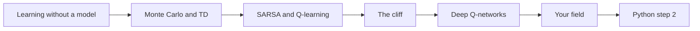
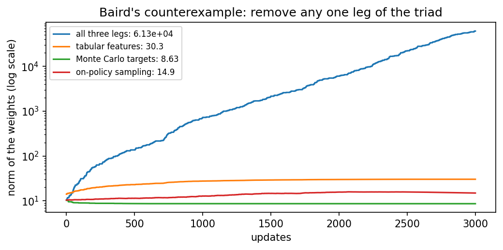
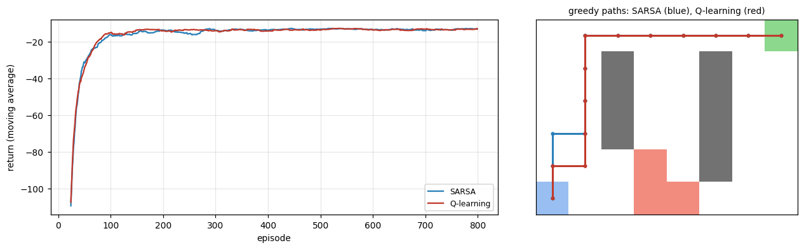

<div align="center">

# Day 02: Value-Based Methods

**Reinforcement Learning and Language Model Alignment (VTR UGE 21)**  
Prof. Dr. Utku Kose, Süleyman Demirel University

[](https://colab.research.google.com/github/utkukose/rl-alignment-veltech-NB-lecture/blob/main/days/day-02/NB02_value_based_methods.ipynb) [](https://utkukose.github.io/rl-alignment-veltech-NB-lecture/days/day-02/lab.html) [](https://utkukose.github.io/rl-alignment-veltech-NB-lecture/days/day-02/lecture.html) [](Day02_Lecture_Notes.pdf)

</div>

## Overview

Day 1 solved problems whose transitions were known. In practice an agent rarely has such a model; it must learn from its own experience. This day covers the methods that learn values directly from experience: Monte Carlo methods, which wait for the end of an episode, temporal difference learning, which learns from each step [1], and the control methods SARSA [2] and Q-learning [3], which differ in one detail with large consequences near a cliff. It ends with a deep Q-network, whose two engineering ideas, replay and a target network [4, 5], are tested by removing them.

**Estimated study time:** 6 to 8 hours.

## Learning outcomes

By the end of the day, students are expected to estimate the value of a policy with Monte Carlo and temporal difference learning and explain from the structure of a problem which of the two will be more accurate, to implement SARSA and Q-learning and explain that their difference comes from exploration, to choose exploration and step-size schedules by measurement, to state the deadly triad and show that removing any one of its legs restores stability, and to build a deep Q-network and measure what experience replay and a target network contribute. In Python, students are expected to create and index NumPy arrays, use them as tables of values and write the update rules of tabular reinforcement learning.

## Python in this day

The lecture ends with Python step 2: NumPy arrays and tables of values. It covers two-dimensional arrays as Q-tables, indexing, `argmax` and `max`, a temporal difference update written by hand and a complete Q-learning loop on a three-state chain, displayed as a pandas table [6, 7]. The hands-on part of the notebook opens with the same step as runnable cells and continues on TokenWorld and the Windy Cliff.

## Live session plan

The day runs as one synchronous session in class or online. The plan below is the default timing, and the same materials serve self-paced study through the study path that follows.

| Time | Activity |
|---|---|
| 0:00 to 0:15 | Recap of Day 1 and the change of the day: The model of the environment is gone |
| 0:15 to 0:50 | Lecture part 1: Monte Carlo and TD with the random-walk animation, then Q-learning and SARSA |
| 0:50 to 1:15 | Python step 2 together, ending with a Q-table learned on a chain |
| 1:15 to 1:25 | Break |
| 1:25 to 2:00 | Lecture part 2: The cliff animation, schedules, function approximation and the deadly triad |
| 2:00 to 2:40 | Hands-on: Notebook sections 1 to 6 in pairs, and the deadly-triad lab |
| 2:40 to 3:00 | The DQN ablation, discussion and self-assessment |

## Study path

| Step | Activity | Suggested time |
|---|---|---|
| 1 | Read the lecture with its animations on the [lecture page](https://utkukose.github.io/rl-alignment-veltech-NB-lecture/days/day-02/lecture.html), or read the [PDF version](Day02_Lecture_Notes.pdf) | 1 hour 30 minutes |
| 2 | Explore the [interactive lab](https://utkukose.github.io/rl-alignment-veltech-NB-lecture/days/day-02/lab.html) | 45 minutes |
| 3 | Study the Python step at the end of the lecture, then run the same step at the start of the hands-on part of the [Colab notebook](https://colab.research.google.com/github/utkukose/rl-alignment-veltech-NB-lecture/blob/main/days/day-02/NB02_value_based_methods.ipynb) | 1 hour |
| 4 | Work through the rest of the notebook, including its exercises | 2 hours 30 minutes |
| 5 | Solve the application challenge of your field | 45 minutes |
| 6 | Take the self-assessment in the lab (tab: Check yourself) | 20 minutes |
| 7 | Write the reflection, export the learning log and complete the daily task | 45 minutes |

## Day at a glance



## Lecture

### Learning without a model

Without a model, values are estimated from experience. A Monte Carlo method plays an episode to its end and moves the value of each visited state towards the return that actually followed. A temporal difference (TD) method does not wait: After each step it moves the value of the state towards the reward plus the discounted value of the next state, an estimate built on another estimate [1]. Monte Carlo is unbiased but noisy; TD is less noisy but starts from biased guesses. Which one learns faster depends on the problem: On TokenWorld, whose reward comes only at the end, Monte Carlo wins; on a random walk with many steps, TD wins.

*Animation on the [lecture page](https://utkukose.github.io/rl-alignment-veltech-NB-lecture/days/day-02/lecture.html): Monte Carlo and temporal difference learning on the five-state random walk, averaged over 40 runs. Change the step size and the number of episodes and compare the errors.*

> [](https://colab.research.google.com/github/utkukose/rl-alignment-veltech-NB-lecture/blob/main/days/day-02/NB02_value_based_methods.ipynb#scrollTo=sec-2) **In Colab, section 2.** Compare Monte Carlo and TD on TokenWorld and on a random walk.

**Check your understanding.** What does a temporal difference update use instead of the full return?

A. Nothing
B. The reward of one step plus the discounted value estimate of the next state
C. The optimal value
D. A model

<details><summary>Answer</summary>

**B.** It bootstraps from its own estimate of the next state.

</details>

### SARSA and Q-learning

To improve behaviour, the agent learns the values of actions, Q-values, and prefers actions with high values while still exploring. SARSA updates towards the value of the action it will actually take next, including exploratory ones [2]; it learns about the policy it follows and is called on-policy. Q-learning updates towards the value of the best next action, whatever it actually does [3]; it learns about the greedy policy while exploring and is called off-policy. Part C of the lab computes one update of each by hand.

> [](https://colab.research.google.com/github/utkukose/rl-alignment-veltech-NB-lecture/blob/main/days/day-02/NB02_value_based_methods.ipynb#scrollTo=sec-3) **In Colab, section 3.** Train SARSA and Q-learning on TokenWorld and compare them with the exact optimum of Day 1.

**Check your understanding.** Q-learning updates towards the best next action even when the agent explores. What is this property called?

A. On-policy
B. Off-policy
C. Monte Carlo
D. Model-based

<details><summary>Answer</summary>

**B.** It learns about the greedy policy while following another.

</details>

### The cliff

The difference shows on a cliff. Q-learning learns the shortest path along the edge, which would be optimal if the agent never explored; while it still explores, it sometimes steps off. SARSA takes its own exploration into account and learns a path further from the edge. During learning, SARSA therefore collects clearly more reward, although Q-learning's final greedy path is shorter. Which is better depends on whether mistakes during learning are expensive, as they are for a real robot.

*Animation on the [lecture page](https://utkukose.github.io/rl-alignment-veltech-NB-lecture/days/day-02/lecture.html): Greedy paths of Q-learning and SARSA after 500 episodes on a cliff, with their returns during learning. Raise the exploration rate and watch SARSA move further from the edge.*

> [](https://colab.research.google.com/github/utkukose/rl-alignment-veltech-NB-lecture/blob/main/days/day-02/NB02_value_based_methods.ipynb#scrollTo=sec-4) **In Colab, section 4.** Run both methods on the cliff and compare their paths and their returns during learning.

**Check your understanding.** Why does SARSA collect more reward than Q-learning while learning on the cliff?

A. It learns faster
B. It accounts for its own exploration and keeps away from the edge
C. It has no exploration
D. It uses a model

<details><summary>Answer</summary>

**B.** An on-policy method values the risk created by its own random moves.

</details>

### Deep Q-networks

When states are too many for a table, a neural network approximates the Q-values. Training it naively is unstable: Successive samples are strongly correlated, and the target moves with every update. A deep Q-network adds two remedies [4]. Experience replay stores past transitions and trains on random batches of them [5], and a target network, a copy updated only now and then, keeps the target still. The notebook writes the network in NumPy and removes each remedy in turn: Without replay the network reaches the optimum in only two thirds of the runs, while without the target network its value estimates are clearly worse.

> [](https://colab.research.google.com/github/utkukose/rl-alignment-veltech-NB-lecture/blob/main/days/day-02/NB02_value_based_methods.ipynb#scrollTo=sec-5) **In Colab, section 5.** Train a deep Q-network in NumPy, then remove replay and the target network one at a time.

**Check your understanding.** What does experience replay do?

A. It replays the best episode
B. It trains on random batches of stored past transitions, which breaks correlations
C. It copies the network
D. It explores

<details><summary>Answer</summary>

**B.** Random batches from a memory decorrelate consecutive samples.

</details>

### Your field

The notebook's switch builds a gridworld from a field: a warehouse with shelves and a forklift lane, a drone route with wind and a no-fly zone, or a building to evacuate with fire. SARSA and Q-learning learn in it side by side, and their greedy paths are drawn on the map.

> [](https://colab.research.google.com/github/utkukose/rl-alignment-veltech-NB-lecture/blob/main/days/day-02/NB02_value_based_methods.ipynb#scrollTo=sec-6) **In Colab, section 6.** Set the switch to warehouse, drone or evacuation and compare SARSA and Q-learning on its map.

### Going further (optional)

Two topics deepen the day. The schedules of the exploration rate and the step size decide whether a method reaches the optimum at all; with both decaying, all eight seeds of the notebook find it, with both constant, only one. Function approximation, bootstrapping and off-policy learning together form the deadly triad [1]: Each is harmless alone, and together they can make the weights grow without limit, as Baird's counterexample shows.

<p align="center"></p>

*Figure. Baird's counterexample: The norm of the weights with all three legs of the triad, and with each leg removed in turn.*

> [](https://colab.research.google.com/github/utkukose/rl-alignment-veltech-NB-lecture/blob/main/days/day-02/NB02_value_based_methods.ipynb#scrollTo=sec-7) **In Colab, section 7.** Compare four schedules over eight seeds and run Baird's counterexample with each leg of the triad removed.

### Python step 2: NumPy arrays and tables of values

Tabular reinforcement learning stores one value per state and action, which is naturally a two-dimensional NumPy array [6]. This step builds such a table, writes the Q-learning update by hand and learns the values of a three-state chain.

#### A Q-table as an array

```python
import numpy as np
Q = np.zeros((3, 2))               # 3 states x 2 actions: 0 = left, 1 = right
Q[0, 1] = 0.5
print(Q.shape)
print(Q)
print("best action in state 0:", int(Q[0].argmax()), " its value:", Q[0].max())
```

*Output*

```text
(3, 2)
[[0.  0.5]
 [0.  0. ]
 [0.  0. ]]
best action in state 0: 1  its value: 0.5
```

`np.zeros((3, 2))` creates a table of three rows and two columns. `Q[0, 1]` addresses row 0, column 1, and `Q[0]` the whole row of state 0. `argmax` returns the position of the largest value in that row, the greedy action, and `max` the value itself.

#### One temporal difference update

```python
alpha, gamma = 0.5, 0.9
s, a, r, s2 = 0, 1, 0.0, 1         # in state 0, action right, reward 0, next state 1
target = r + gamma * Q[s2].max()
Q[s, a] += alpha * (target - Q[s, a])
print("target:", target, " new Q[0, 1]:", Q[s, a])
```

*Output*

```text
target: 0.0  new Q[0, 1]: 0.25
```

The target is the reward plus the discounted best value of the next state. The update moves the old value a fraction `alpha` of the way towards the target. Since the next state is still unknown territory, the target is 0 and the value shrinks from 0.5 to 0.25.

#### An environment as a function

```python
def chain_step(s, a):
    """Three states in a row; moving right from state 2 pays 1 and ends the episode."""
    if a == 1 and s == 2:
        return s, 1.0, True
    s2 = min(s + 1, 2) if a == 1 else max(s - 1, 0)
    return s2, 0.0, False

print(chain_step(0, 1), chain_step(2, 1), chain_step(1, 0))
```

*Output*

```text
(1, 0.0, False) (2, 1.0, True) (0, 0.0, False)
```

The function returns three values at once, a tuple: The next state, the reward and whether the episode has ended. `min` and `max` keep the state inside the chain.

#### Q-learning on the chain

```python
rng = np.random.default_rng(0)
Q = np.zeros((3, 2))
for episode in range(200):
    s, done = 0, False
    while not done:
        a = int(rng.integers(2)) if rng.random() < 0.2 else int(Q[s].argmax())
        s2, r, done = chain_step(s, a)
        target = r if done else r + gamma * Q[s2].max()
        Q[s, a] += alpha * (target - Q[s, a])
        s = s2
print(Q.round(3))
```

*Output*

```text
[[0.729 0.81 ]
 [0.729 0.9  ]
 [0.81  1.   ]]
```

The `while` loop runs until the episode ends. The agent explores with probability 0.2 and otherwise acts greedily. At the end, the value of moving right is 1 in state 2, 0.9 in state 1 and 0.81 in state 0: Each step away from the reward multiplies it by the discount 0.9.

#### The table, readable

```python
import pandas as pd
table = pd.DataFrame(Q.round(3), index=["state 0", "state 1", "state 2"], columns=["left", "right"])
print(table)
print("greedy policy:", ["right" if row.argmax() == 1 else "left" for row in Q])
```

*Output*

```text
          left  right
state 0  0.729   0.81
state 1  0.729   0.90
state 2  0.810   1.00
greedy policy: ['right', 'right', 'right']
```

A pandas data frame adds names to the rows and columns of the array [7]. Looping over a two-dimensional array visits its rows, so the list comprehension reads the greedy action of every state.

**Quick check.** Why is the target `r` alone, without the value of the next state, when the episode ends?

<details><summary>Answer</summary>

Because nothing follows the end of an episode: The value of a terminal state is zero, so only the final reward counts.

</details>

## Application challenges

Each challenge transfers the ideas of the day to a field of study. Choose the one closest to your programme, solve it in a copy of the notebook and add the result to your learning log.

| Field | Challenge |
|---|---|
| Computer Science and Engineering | Add Double Q-learning to the DQN of section 7 and measure whether it changes the error of the values on TokenWorld. |
| Electronics and Communication Engineering | Formulate the choice of a modulation scheme under a changing channel as a small MDP and learn it with Q-learning. |
| Electrical and Electronics Engineering | Use SARSA to learn a charging policy for a battery with three states of charge and a two-level electricity price. |
| Mechanical Engineering | Learn a maintenance policy for a machine with four wear levels with Q-learning and compare it with the policy from value iteration. |
| Biomedical Engineering | Explain, with the cliff example, why an on-policy method might be preferred for a treatment policy that keeps exploring in practice. |
| Civil Engineering | Learn a traffic-light policy for one intersection with two queue lengths per direction and report the spread over ten seeds. |
| Aeronautical Engineering | Repeat the deadly-triad experiment with a smaller step size and report whether the divergence disappears or only slows down. |
| Biotechnology | Model a feeding schedule for a bioreactor as an MDP with three biomass levels and learn it with SARSA. |

## Interactive lab

<p align="center"><a href="https://utkukose.github.io/rl-alignment-veltech-NB-lecture/days/day-02/lab.html"></a></p>

**[Value-based lab](https://utkukose.github.io/rl-alignment-veltech-NB-lecture/days/day-02/lab.html).** Part A explores the deadly triad on Baird's counterexample. Part B classifies methods as on-policy or off-policy, temporal difference, Monte Carlo or dynamic programming. Part C computes one update of Q-learning and one of SARSA by hand. The lab runs in any modern browser, including on a phone, and keeps your progress in the browser only.

## Colab notebook

<table><tr><td width="50%"></td><td width="50%"></td></tr></table>

[](https://colab.research.google.com/github/utkukose/rl-alignment-veltech-NB-lecture/blob/main/days/day-02/NB02_value_based_methods.ipynb) The notebook `NB02_value_based_methods.ipynb` contains the full lecture text, the Python step as runnable cells, the hands-on lab with exercises that give immediate feedback, reference solutions in collapsed cells and interactive exploration cells. It runs in Google Colab with no installation.

## Self-assessment and reflection

The tab *Check yourself* of the [interactive lab](https://utkukose.github.io/rl-alignment-veltech-NB-lecture/days/day-02/lab.html) holds 8 questions with a confidence rating for each answer. A confident error marks a topic to revisit first. The tab *Reflect and export* asks three reflection questions and exports a learning log as a Markdown file. The self-assessment is formative and does not count towards the grade.

## Daily task and submission

Repeat the comparison of Monte Carlo and temporal difference learning of section 2 on the five-state random walk of the lecture animation, implemented in Python. Report which estimator wins on each problem and explain the difference in about 200 words, using the length of the episodes and the noise of the returns.

The task is optional and supports self-learning and a personal portfolio. During an active delivery of the course, it can be sent together with the exported learning log to utkukose@sdu.edu.tr or utkukose@gmail.com.

## Research and report assignment (optional)

**Stability of value-based deep reinforcement learning.** Review the deadly triad and the techniques used to stabilise deep Q-learning, from experience replay and target networks to double estimators [1, 4, 8]. Summarise what is known about when divergence occurs in practice. The report should be about 1500 words with at least eight sources.

## References

[1] Sutton, R. S., & Barto, A. G. (2018). Reinforcement Learning: An Introduction (2nd ed.). MIT Press.

[2] Rummery, G. A., & Niranjan, M. (1994). On-line Q-learning using connectionist systems (Technical Report CUED/F-INFENG/TR 166). Cambridge University Engineering Department.

[3] Watkins, C. J. C. H., & Dayan, P. (1992). Q-learning. Machine Learning, 8(3-4), 279-292.

[4] Mnih, V., Kavukcuoglu, K., Silver, D., Rusu, A. A., Veness, J., Bellemare, M. G., Graves, A., Riedmiller, M., Fidjeland, A. K., Ostrovski, G., et al. (2015). Human-level control through deep reinforcement learning. Nature, 518(7540), 529-533. <https://doi.org/10.1038/nature14236>

[5] Lin, L.-J. (1992). Self-improving reactive agents based on reinforcement learning, planning and teaching. Machine Learning, 8(3-4), 293-321.

[6] Harris, C. R., Millman, K. J., van der Walt, S. J., Gommers, R., Virtanen, P., Cournapeau, D., Wieser, E., Taylor, J., Berg, S., Smith, N. J., et al. (2020). Array programming with NumPy. Nature, 585(7825), 357-362. <https://doi.org/10.1038/s41586-020-2649-2>

[7] McKinney, W. (2010). Data structures for statistical computing in Python. In Proceedings of the 9th Python in Science Conference (pp. 56-61). <https://doi.org/10.25080/Majora-92bf1922-00a>

[8] van Hasselt, H., Guez, A., & Silver, D. (2016). Deep reinforcement learning with double Q-learning. In Proceedings of the AAAI Conference on Artificial Intelligence, 30(1), 2094-2100.
