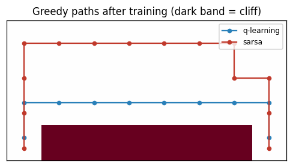
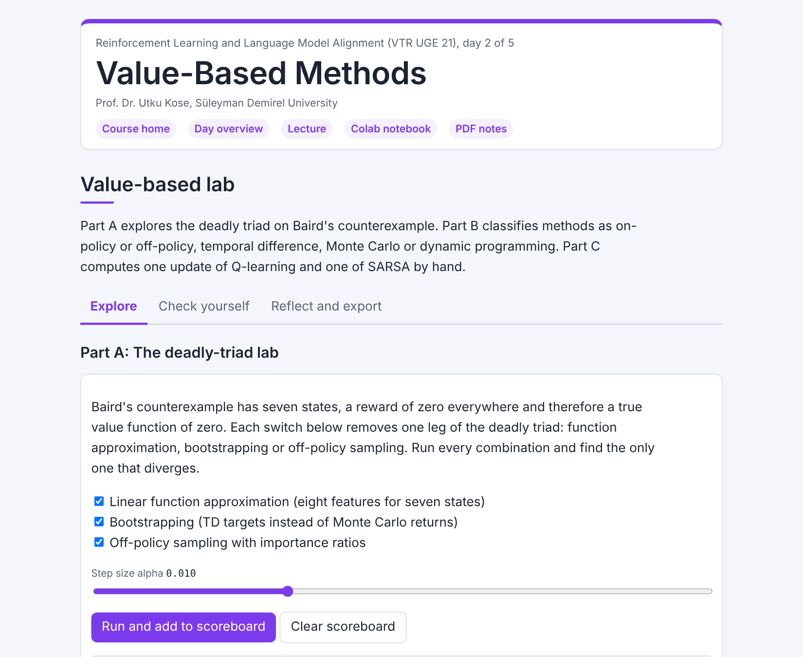

# Day 02: Value-Based Methods

**Reinforcement Learning and Language Model Alignment (VTR UGE 21)**  
Prof. Dr. Utku Kose, Süleyman Demirel University

   

Learning values without a model: Monte Carlo and temporal differences, the control methods SARSA (state, action, reward, state, action) and Q-learning, the cliff, and a deep Q-network written in NumPy. **Estimated study time:** 6 to 8 hours.

## Materials of the day

Each material has its own role. Start with the lecture page; the study path below gives the order and the time of each step.

| Material | What it holds | Open |
|---|---|---|
| Lecture page | The concepts of the day, with animations, knowledge checks, review cards and the references | [Lecture page](https://utkukose.github.io/rl-alignment-veltech-NB-lecture/days/day-02/lecture.html) |
| Colab notebook | Python step 2: NumPy arrays and tables of values, then the hands-on sections with exercises, an application switch and the application challenges |  |
| Interactive lab | Value-based lab: Three practice parts, a self-assessment and an exportable learning log | [Interactive lab](https://utkukose.github.io/rl-alignment-veltech-NB-lecture/days/day-02/lab.html) |
| PDF lecture notes | The lecture and the Python step in one printable file | [PDF notes](Day02_Lecture_Notes.pdf) |

<table><tr><td width="50%"> From the Colab notebook</td><td width="50%"> The interactive lab</td></tr></table>

## Learning outcomes

By the end of the day, students are expected to estimate the value of a policy with Monte Carlo and temporal difference learning and explain from the structure of a problem which of the two will be more accurate, to implement SARSA and Q-learning and explain that their difference comes from exploration, to choose exploration and step-size schedules by measurement, to state the deadly triad and show that removing any one of its legs restores stability, and to build a deep Q-network and measure what experience replay and a target network contribute. In Python, students are expected to create and index NumPy arrays, use them as tables of values and write the update rules of tabular reinforcement learning.

## Study path

| Step | Activity | Suggested time |
|---|---|---|
| 1 | Read the [lecture page](https://utkukose.github.io/rl-alignment-veltech-NB-lecture/days/day-02/lecture.html) and answer its knowledge checks | 1 hour 30 minutes |
| 2 | Work through parts A, B and C of the [interactive lab](https://utkukose.github.io/rl-alignment-veltech-NB-lecture/days/day-02/lab.html) | 45 minutes |
| 3 | Run Python step 2: NumPy arrays and tables of values in the [Colab notebook](https://colab.research.google.com/github/utkukose/rl-alignment-veltech-NB-lecture/blob/main/days/day-02/NB02_value_based_methods.ipynb#scrollTo=python-step), right after the setup cell | 1 hour |
| 4 | Work through the numbered sections of the notebook and their exercises | 2 hours 30 minutes |
| 5 | Use the application switch of the notebook and solve the application challenge of your field | 45 minutes |
| 6 | Take the self-assessment in the [interactive lab](https://utkukose.github.io/rl-alignment-veltech-NB-lecture/days/day-02/lab.html) (tab: Check yourself) | 20 minutes |
| 7 | Write the reflection in the lab, export the learning log and complete the daily task below | 45 minutes |

## Live session plan

The day runs as one synchronous session in class or online, and each material has one role in it. The lecture page is on the screen, and at each orange Colab box the instructor shows the matching section in a copy of the notebook that has already been run. Students work in their own copy of the notebook from top to bottom, and each lab part follows the lecture part it practises. The PDF lecture notes serve reading after the session, and the study path above serves self-paced study.

| Time | Activity |
|---|---|
| 0:00 to 0:10 | Opening: Recap of Day 1 and the change of the day: The model of the environment is gone. Students open the notebook in Colab, save a copy and run section 0 |
| 0:10 to 0:50 | Lecture page, part 1: Monte Carlo and temporal differences with the random-walk animation, SARSA and Q-learning; then lab Part C by hand |
| 0:50 to 1:15 | Colab, together: Python step 2, ending with Monte Carlo and temporal difference estimates for a chain |
| 1:15 to 1:25 | Break |
| 1:25 to 1:55 | Lecture page, part 2: The cliff with its animation, deep Q-networks with replay and a target network; then lab Part B with the whole class |
| 1:55 to 2:40 | Colab, in pairs: Sections 1 to 5 with their exercises, then section 6 with a different domain for each pair |
| 2:40 to 3:00 | Lab and closing: Part A, the deadly triad on Baird's counterexample, as an outlook, then the self-assessment; after the session: The PDF notes, the daily task and the optional section 7 |

## Daily task and submission

Repeat the comparison of Monte Carlo and temporal difference learning of section 2 on the five-state random walk of the lecture animation, implemented in Python. Report which estimator wins on each problem and explain the difference in about 200 words, using the length of the episodes and the noise of the returns.

The task is optional and supports self-learning and a personal portfolio. During an active delivery of the course, it can be sent together with the exported learning log to utkukose@sdu.edu.tr or utkukose@gmail.com.

## Research and report assignment (optional)

**Stability of value-based deep reinforcement learning.** Review the deadly triad and the techniques used to stabilise deep Q-learning, from experience replay and target networks to double estimators &#91;[1](https://utkukose.github.io/rl-alignment-veltech-NB-lecture/days/day-02/lecture.html#ref-1), [4](https://utkukose.github.io/rl-alignment-veltech-NB-lecture/days/day-02/lecture.html#ref-4), [9](https://utkukose.github.io/rl-alignment-veltech-NB-lecture/days/day-02/lecture.html#ref-9)&#93;. Summarise what is known about when divergence occurs in practice. The report should be about 1500 words with at least eight sources.
