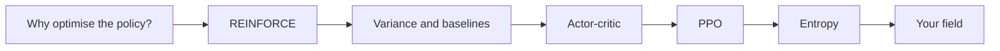
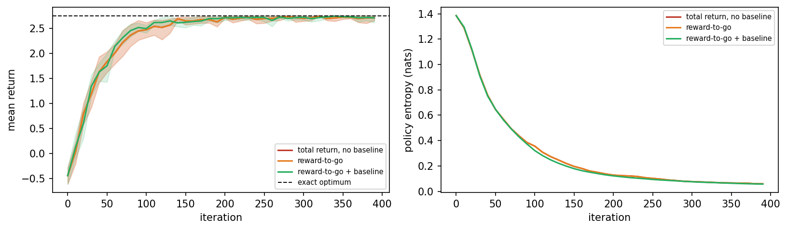
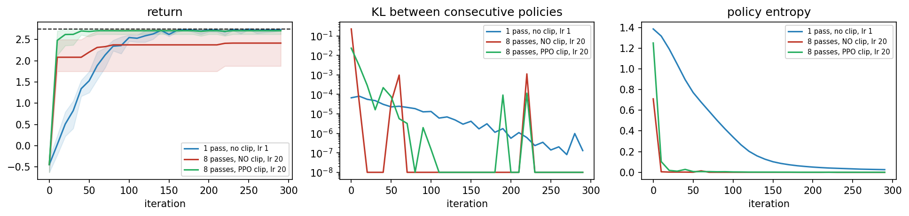
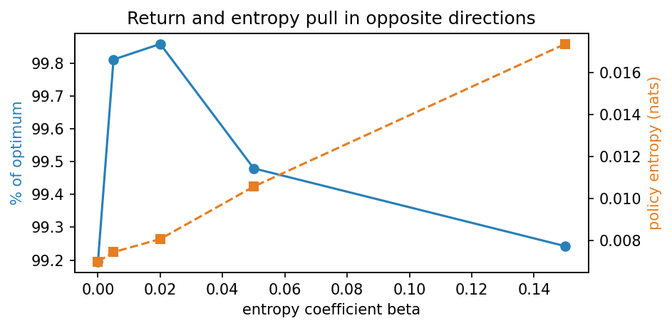
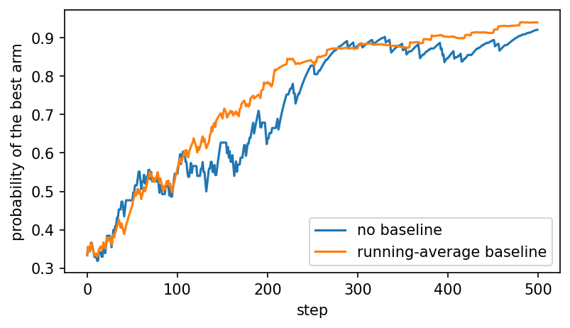
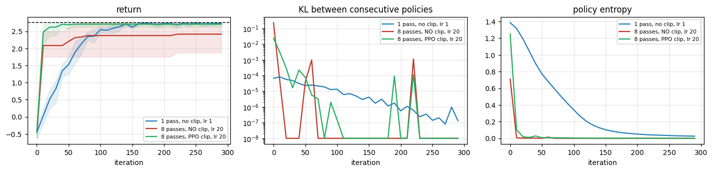

<div align="center">

# Day 03: Policy Gradient Methods

**Reinforcement Learning and Language Model Alignment (VTR UGE 21)**  
Prof. Dr. Utku Kose, Süleyman Demirel University

[](https://colab.research.google.com/github/utkukose/rl-alignment-veltech-NB-lecture/blob/main/days/day-03/NB03_policy_gradient_methods.ipynb) [](https://utkukose.github.io/rl-alignment-veltech-NB-lecture/days/day-03/lab.html) [](https://utkukose.github.io/rl-alignment-veltech-NB-lecture/days/day-03/lecture.html) [](Day03_Lecture_Notes.pdf)

</div>

## Overview

Value-based methods learn values and derive a policy from them. Policy gradient methods change the policy directly, in the direction that increases the expected return [1, 2]. This is the family used to train language models with human feedback on Day 4. This day derives REINFORCE, measures how noisy its estimates are and reduces the noise with a baseline, introduces actor-critic methods with generalised advantage estimation [3, 4], and limits the size of each update with the clipped objective of PPO [5]. It ends with entropy, the measure of how much a policy still explores, and a metric that hides its collapse.

**Estimated study time:** 6 to 8 hours.

## Learning outcomes

By the end of the day, students are expected to explain why policy methods suit stochastic policies and large action spaces, to derive the score-function form of the policy gradient and implement REINFORCE, to measure the variance of the estimator and explain when reward-to-go and a baseline reduce it, to build an actor-critic and read the parameter of generalised advantage estimation as a bias-variance dial, to compare plain policy gradient with the clipped objective of PPO under the same data reuse and to state the limits of the clip, and to monitor the entropy of a policy over the states it visits. In Python, students are expected to compute with NumPy vectors, write a numerically stable softmax and its log-gradient, and plot learning curves.

## Python in this day

The lecture ends with Python step 3: Vectors, the softmax and learning curves. It covers vectors of preferences, a numerically stable softmax, the gradient of a log-probability, a REINFORCE update on a three-armed bandit with and without a baseline, and a learning curve drawn with Matplotlib [6, 7]. The hands-on part of the notebook opens with the same step as runnable cells and continues on TokenWorld.

## Live session plan

The day runs as one synchronous session in class or online. The plan below is the default timing, and the same materials serve self-paced study through the study path that follows.

| Time | Activity |
|---|---|
| 0:00 to 0:15 | Recap of Day 2 and the question of the day: What if the policy itself is the parameter? |
| 0:15 to 0:50 | Lecture part 1: The policy gradient theorem, REINFORCE and its variance, with the REINFORCE animation |
| 0:50 to 1:15 | Python step 3 together, ending with two learning curves |
| 1:15 to 1:25 | Break |
| 1:25 to 2:00 | Lecture part 2: Actor-critic, trust regions and the clipped objective, with the PPO animation |
| 2:00 to 2:40 | Hands-on: Notebook sections 1 to 6 in pairs, and the trust-region bench of the lab |
| 2:40 to 3:00 | Entropy as a diagnostic, the bridge to RLHF, discussion and self-assessment |

## Study path

| Step | Activity | Suggested time |
|---|---|---|
| 1 | Read the lecture with its animations on the [lecture page](https://utkukose.github.io/rl-alignment-veltech-NB-lecture/days/day-03/lecture.html), or read the [PDF version](Day03_Lecture_Notes.pdf) | 1 hour 30 minutes |
| 2 | Explore the [interactive lab](https://utkukose.github.io/rl-alignment-veltech-NB-lecture/days/day-03/lab.html) | 45 minutes |
| 3 | Study the Python step at the end of the lecture, then run the same step at the start of the hands-on part of the [Colab notebook](https://colab.research.google.com/github/utkukose/rl-alignment-veltech-NB-lecture/blob/main/days/day-03/NB03_policy_gradient_methods.ipynb) | 1 hour |
| 4 | Work through the rest of the notebook, including its exercises | 2 hours 30 minutes |
| 5 | Solve the application challenge of your field | 45 minutes |
| 6 | Take the self-assessment in the lab (tab: Check yourself) | 20 minutes |
| 7 | Write the reflection, export the learning log and complete the daily task | 45 minutes |

## Day at a glance



## Lecture

### Why optimise the policy directly?

A policy can be written as a function with parameters that gives a probability to every action, for example a softmax over scores. Changing the parameters changes the behaviour smoothly, which suits continuous actions and stochastic policies, and it is the natural form of a language model, which already outputs a probability for every next word. The question is in which direction to change the parameters to collect more reward.

### REINFORCE

The policy gradient theorem answers it [2]. REINFORCE turns the answer into an algorithm [1]: Play an episode, and for every action taken, push its log-probability up in proportion to the return that followed. Actions followed by high returns become more likely, actions followed by low returns less likely. The estimate is unbiased, but it is noisy, because one episode's return reflects many random choices, as the animation shows.

$$
\nabla_\theta J(\theta) = \mathbb{E}\left[ \sum_t \nabla_\theta \log \pi_\theta(a_t \mid s_t)\, G_t \right]
$$

*Animation on the [lecture page](https://utkukose.github.io/rl-alignment-veltech-NB-lecture/days/day-03/lecture.html): REINFORCE on a three-armed bandit. The thick line is the probability of the best arm. Switch the baseline off and raise the learning rate to see the noise of the updates.*

**Check your understanding.** In REINFORCE, which actions become more likely?

A. All actions equally
B. Actions followed by high returns
C. The actions with the highest Q-values
D. Random actions

<details><summary>Answer</summary>

**B.** Each log-probability is pushed in proportion to the return that followed.

</details>

### Variance and baselines

Subtracting a baseline from the return, for example the average return from that state, does not change the expected gradient but can reduce its variance considerably. The notebook measures the variance of the estimator directly over thousands of samples. A baseline reduces it on TokenWorld, while another popular trick, using only the rewards that come after each action, changes nothing there, because the whole reward of TokenWorld arrives at the end. A trick is only as good as its fit to the problem.

> [](https://colab.research.google.com/github/utkukose/rl-alignment-veltech-NB-lecture/blob/main/days/day-03/NB03_policy_gradient_methods.ipynb#scrollTo=sec-2) **In Colab, section 2.** Measure the variance of the REINFORCE estimator with and without a baseline, over thousands of samples.

**Check your understanding.** What does subtracting a baseline change in the policy gradient?

A. Its expected value
B. Its variance, without changing its expected value
C. The policy
D. The reward

<details><summary>Answer</summary>

**B.** A baseline that does not depend on the action leaves the expectation unchanged.

</details>

### Actor-critic

An actor-critic method learns a value function, the critic, alongside the policy, the actor, and uses the critic to judge each action: The advantage tells how much better an action was than expected [4]. Generalised advantage estimation blends advantages over one step and over many steps with a parameter lambda [3]; small lambda trusts the critic more, large lambda trusts the observed returns more. On TokenWorld a middle value works best.

<p align="center"></p>

*Figure. REINFORCE on TokenWorld with three estimators over eight seeds: Return against the exact optimum, and policy entropy.*

> [](https://colab.research.google.com/github/utkukose/rl-alignment-veltech-NB-lecture/blob/main/days/day-03/NB03_policy_gradient_methods.ipynb#scrollTo=sec-3) **In Colab, section 3.** Train REINFORCE on TokenWorld over eight seeds and compare it with the exact optimum.

> [](https://colab.research.google.com/github/utkukose/rl-alignment-veltech-NB-lecture/blob/main/days/day-03/NB03_policy_gradient_methods.ipynb#scrollTo=sec-4) **In Colab, section 4.** Train an actor-critic with generalised advantage estimation for three values of lambda.

### Trust regions and PPO

A policy gradient step that is too large can destroy a good policy in one update, and reusing the same data for several updates makes this worse. Proximal policy optimisation limits each change [5]. It compares the new and the old probability of each action as a ratio and clips the ratio to a small range around one, so that the objective stops rewarding changes beyond it. On TokenWorld with eight passes over each batch, PPO keeps learning where the plain gradient overshoots. The clip is no cure-all: With a very large learning rate, PPO also fails. Part C of the lab evaluates the clipped objective by hand.

*Animation on the [lecture page](https://utkukose.github.io/rl-alignment-veltech-NB-lecture/days/day-03/lecture.html): The clipped objective for a positive and a negative advantage. Move the ratio past the clip range and watch the gradient become zero.*

<p align="center"></p>

*Figure. Return, KL divergence between consecutive policies and entropy, for one pass without clipping and for eight passes with and without the clip.*

> [](https://colab.research.google.com/github/utkukose/rl-alignment-veltech-NB-lecture/blob/main/days/day-03/NB03_policy_gradient_methods.ipynb#scrollTo=sec-5) **In Colab, section 5.** Compare the plain policy gradient with PPO under the same reuse of data.

**Check your understanding.** What happens to the PPO objective when the probability ratio of an action with positive advantage exceeds 1 plus epsilon?

A. It grows faster
B. It stops growing, so the gradient pushes no further
C. It becomes negative
D. Nothing

<details><summary>Answer</summary>

**B.** The clip removes the incentive to move the probability further in one update.

</details>

### Entropy

The entropy of a policy measures how spread out its choices are. A policy that has stopped exploring has almost zero entropy. An entropy bonus in the objective keeps exploration alive, at the cost of some return. The notebook also shows a metric that hides a collapse: The entropy averaged over all states looks healthy, while over the states the policy actually visits it is almost zero.

<p align="center"></p>

*Figure. Return and entropy against the entropy bonus: The two pull in opposite directions.*

> [](https://colab.research.google.com/github/utkukose/rl-alignment-veltech-NB-lecture/blob/main/days/day-03/NB03_policy_gradient_methods.ipynb#scrollTo=sec-6) **In Colab, section 6.** Measure the entropy of the trained policy over all states and over the states it actually visits.

**Check your understanding.** The entropy over all states is 1.2 nats, over the visited states almost 0. What has happened?

A. The policy explores well
B. The policy has become nearly deterministic where it actually acts
C. The metric is wrong
D. Nothing

<details><summary>Answer</summary>

**B.** Unvisited states keep their initial uncertainty and mask the collapse.

</details>

### Your field

The notebook's switch loads the gridworld of Day 2 from a field and trains three policy gradient learners in it: REINFORCE without and with a baseline, and an actor-critic. In the warehouse the baseline already helps; on the windy drone route and in the burning building, only the actor-critic learns within the budget, because returns from whole episodes are too noisy when hazards and slips are common.

> [](https://colab.research.google.com/github/utkukose/rl-alignment-veltech-NB-lecture/blob/main/days/day-03/NB03_policy_gradient_methods.ipynb#scrollTo=sec-7) **In Colab, section 7.** Set the switch to warehouse, drone or evacuation and compare the three learners.

### Going further (optional)

The optional section repeats the variance measurement on a variant of TokenWorld with rewards along the way, where using only the later rewards does help. It then sweeps the learning rate to show how much aggressiveness the clip of PPO can absorb before it fails.

> [](https://colab.research.google.com/github/utkukose/rl-alignment-veltech-NB-lecture/blob/main/days/day-03/NB03_policy_gradient_methods.ipynb#scrollTo=sec-8) **In Colab, section 8.** Measure the variance with dense rewards and sweep the learning rate of PPO.

### Python step 3: Vectors, the softmax and learning curves

A policy over a few actions is a vector of preferences turned into probabilities by the softmax. This step writes the softmax and the gradient of a log-probability with NumPy, runs REINFORCE on a three-armed bandit with and without a baseline and draws the two learning curves [6, 7].

#### Preferences and the softmax

```python
import numpy as np
def softmax(z):
    """Probabilities from preferences; subtracting the maximum avoids overflow."""
    e = np.exp(z - z.max())
    return e / e.sum()

theta = np.array([0.0, 0.0, 0.0])        # one preference per arm
p = softmax(theta)
print(p, p.sum())
print(softmax(np.array([1.0, 2.0, 3.0])).round(3))
```

*Output*

```text
[0.33333333 0.33333333 0.33333333] 1.0
[0.09  0.245 0.665]
```

The softmax exponentiates every preference and divides by the sum, so the result is positive and sums to 1. Subtracting the largest preference first does not change the result and prevents overflow for large values, a standard precaution.

#### The gradient of a log-probability

```python
a = 1
grad_logp = np.eye(3)[a] - p              # gradient of log pi(a) for a softmax policy
print("log pi(a):", round(float(np.log(p[a])), 4))
print("gradient :", grad_logp.round(3), " sum:", round(float(grad_logp.sum()), 10))
```

*Output*

```text
log pi(a): -1.0986
gradient : [-0.333  0.667 -0.333]  sum: 0.0
```

For a softmax policy, the gradient of the log-probability of action $a$ with respect to the preferences is the one-hot vector of $a$ minus the probabilities. `np.eye(3)[a]` takes row `a` of the identity matrix, which is that one-hot vector. The components always sum to zero.

#### REINFORCE on a bandit, with and without a baseline

```python
win = np.array([0.2, 0.8, 0.5])          # true win rates, unknown to the agent
lr = 0.1
def reinforce(use_baseline, seed=0, steps=500):
    rng = np.random.default_rng(seed)
    th, avg, curve = np.zeros(3), 0.0, []
    for t in range(steps):
        p = softmax(th)
        a = rng.choice(3, p=p)
        r = float(rng.random() < win[a])
        adv = r - avg if use_baseline else r
        th += lr * adv * (np.eye(3)[a] - p)
        avg += 0.05 * (r - avg)
        curve.append(p[1])
    return np.array(curve)

plain, based = reinforce(False), reinforce(True)
print("probability of the best arm after 500 steps:", round(float(plain[-1]), 3), "and", round(float(based[-1]), 3))
```

*Output*

```text
probability of the best arm after 500 steps: 0.921 and 0.94
```

`rng.choice(3, p=p)` draws an arm with the probabilities of the policy. The update adds the learning rate times the advantage times the gradient of the log-probability. With the baseline, the advantage is the reward minus a running average, so an ordinary reward no longer pushes the chosen arm up.

#### A learning curve

```python
import matplotlib.pyplot as plt
plt.figure(figsize=(6, 3.2))
plt.plot(plain, label="no baseline")
plt.plot(based, label="running-average baseline")
plt.xlabel("step"); plt.ylabel("probability of the best arm"); plt.legend()
plt.show()
```

<p align="center"></p>

Each call of `plt.plot` adds one line, and `label` names it for the legend. A learning curve over one seed is an illustration, not a result; the notebook repeats such curves over several seeds, as the rules of Day 1 require.

**Quick check.** Why does subtracting a baseline that does not depend on the action leave the gradient unbiased?

<details><summary>Answer</summary>

Because the expected value of the gradient of the log-probability is zero: The probabilities sum to 1 for every parameter value, so their gradients sum to zero, and a constant times zero is zero.

</details>

## Application challenges

Each challenge transfers the ideas of the day to a field of study. Choose the one closest to your programme, solve it in a copy of the notebook and add the result to your learning log.

| Field | Challenge |
|---|---|
| Computer Science and Engineering | Implement a KL-penalised update instead of the clip and compare it with PPO at the learning rates of section 7. |
| Electronics and Communication Engineering | Use REINFORCE to learn a power-allocation policy over three channels with noisy rewards, and measure the effect of a baseline on the variance. |
| Electrical and Electronics Engineering | Train a softmax policy to choose among four tariff plans for a household battery, with rewards drawn from simulated bills. |
| Mechanical Engineering | Design a two-step decision problem for maintenance timing and compare REINFORCE with an actor-critic on it. |
| Biomedical Engineering | Discuss why an entropy bonus might be required for a treatment-recommendation policy, and how you would measure its entropy fairly. |
| Civil Engineering | Train a policy over three traffic-light timing plans on a simulated intersection and report the spread over ten seeds. |
| Aeronautical Engineering | Repeat the comparison of section 6 with two passes instead of eight and report whether the clip still matters. |
| Biotechnology | Use a softmax policy to choose among four culture media with noisy yields and show the learning curve with and without a baseline over several seeds. |

## Interactive lab

<p align="center"><a href="https://utkukose.github.io/rl-alignment-veltech-NB-lecture/days/day-03/lab.html"></a></p>

**[Policy gradient lab](https://utkukose.github.io/rl-alignment-veltech-NB-lecture/days/day-03/lab.html).** Part A updates a policy with and without the PPO clip and shows how far each update moves it. Part B matches the ingredients of policy gradient methods with their effects. Part C evaluates the clipped objective by hand. The lab runs in any modern browser, including on a phone, and keeps your progress in the browser only.

## Colab notebook

<table><tr><td width="50%"></td><td width="50%"></td></tr></table>

[](https://colab.research.google.com/github/utkukose/rl-alignment-veltech-NB-lecture/blob/main/days/day-03/NB03_policy_gradient_methods.ipynb) The notebook `NB03_policy_gradient_methods.ipynb` contains the full lecture text, the Python step as runnable cells, the hands-on lab with exercises that give immediate feedback, reference solutions in collapsed cells and interactive exploration cells. It runs in Google Colab with no installation.

## Self-assessment and reflection

The tab *Check yourself* of the [interactive lab](https://utkukose.github.io/rl-alignment-veltech-NB-lecture/days/day-03/lab.html) holds 8 questions with a confidence rating for each answer. A confident error marks a topic to revisit first. The tab *Reflect and export* asks three reflection questions and exports a learning log as a Markdown file. The self-assessment is formative and does not count towards the grade.

## Daily task and submission

Repeat the entropy sweep of section 8 and add a column with the entropy averaged over all states. Plot both entropies against the entropy bonus and write about 200 words explaining to a colleague why the two curves disagree and which one a training dashboard should show.

The task is optional and supports self-learning and a personal portfolio. During an active delivery of the course, it can be sent together with the exported learning log to utkukose@sdu.edu.tr or utkukose@gmail.com.

## Research and report assignment (optional)

**Trust regions in policy optimisation.** Review the development from natural and trust-region policy gradients to PPO and its implementation details [5, 8, 9]. Summarise what is known about the role of clipping, advantage normalisation and data reuse. The report should be about 1500 words with at least eight sources.

## References

[1] Williams, R. J. (1992). Simple statistical gradient-following algorithms for connectionist reinforcement learning. Machine Learning, 8(3-4), 229-256.

[2] Sutton, R. S., McAllester, D., Singh, S., & Mansour, Y. (2000). Policy gradient methods for reinforcement learning with function approximation. In Advances in Neural Information Processing Systems 12 (NIPS 1999) (pp. 1057-1063).

[3] Schulman, J., Moritz, P., Levine, S., Jordan, M., & Abbeel, P. (2016). High-dimensional continuous control using generalized advantage estimation. In 4th International Conference on Learning Representations (ICLR 2016). arXiv:1506.02438.

[4] Mnih, V., Badia, A. P., Mirza, M., Graves, A., Lillicrap, T., Harley, T., Silver, D., & Kavukcuoglu, K. (2016). Asynchronous methods for deep reinforcement learning. In Proceedings of the 33rd International Conference on Machine Learning (ICML 2016), PMLR 48, 1928-1937. <https://proceedings.mlr.press/v48/mniha16.html>

[5] Schulman, J., Wolski, F., Dhariwal, P., Radford, A., & Klimov, O. (2017). Proximal policy optimization algorithms. arXiv preprint arXiv:1707.06347. <https://arxiv.org/abs/1707.06347>

[6] Harris, C. R., Millman, K. J., van der Walt, S. J., Gommers, R., Virtanen, P., Cournapeau, D., Wieser, E., Taylor, J., Berg, S., Smith, N. J., et al. (2020). Array programming with NumPy. Nature, 585(7825), 357-362. <https://doi.org/10.1038/s41586-020-2649-2>

[7] Hunter, J. D. (2007). Matplotlib: A 2D graphics environment. Computing in Science & Engineering, 9(3), 90-95.

[8] Schulman, J., Levine, S., Abbeel, P., Jordan, M., & Moritz, P. (2015). Trust region policy optimization. In Proceedings of the 32nd International Conference on Machine Learning (ICML 2015), PMLR 37, 1889-1897.

[9] Engstrom, L., Ilyas, A., Santurkar, S., Tsipras, D., Janoos, F., Rudolph, L., & Madry, A. (2020). Implementation matters in deep RL: A case study on PPO and TRPO. In 8th International Conference on Learning Representations (ICLR 2020).
