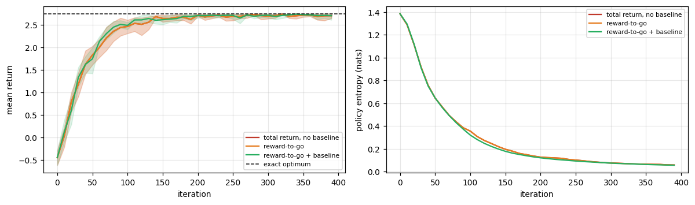
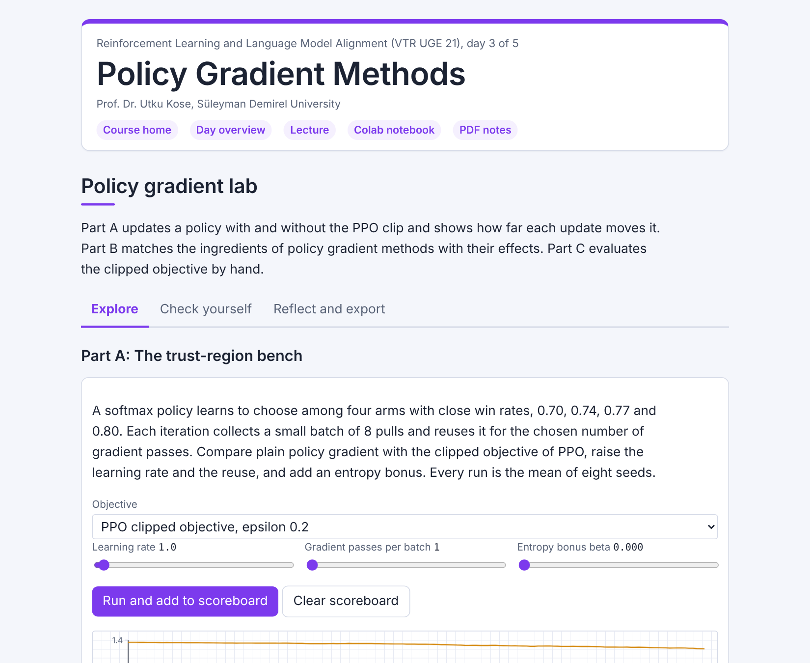

# Day 03: Policy Gradient Methods

**Reinforcement Learning and Language Model Alignment (VTR UGE 21)**  
Prof. Dr. Utku Kose, Süleyman Demirel University

   

Optimising the policy directly: the REINFORCE algorithm and its variance, baselines, actor-critic methods, the clipped objective of proximal policy optimisation (PPO), and entropy. **Estimated study time:** 6 to 8 hours.

## Materials of the day

Each material has its own role. Start with the lecture page; the study path below gives the order and the time of each step.

| Material | What it holds | Open |
|---|---|---|
| Lecture page | The concepts of the day, with animations, an interactive scene, knowledge checks, review cards and the references | [Lecture page](https://utkukose.github.io/rl-alignment-veltech-NB-lecture/days/day-03/lecture.html) |
| Colab notebook | Python step 3: Vectors, the softmax and learning curves, then the hands-on sections with exercises, an application switch and the application challenges |  |
| Interactive lab | Policy gradient lab: Five practice parts, a self-assessment and an exportable learning log | [Interactive lab](https://utkukose.github.io/rl-alignment-veltech-NB-lecture/days/day-03/lab.html) |
| PDF lecture notes | The lecture and the Python step in one printable file | [PDF notes](Day03_Lecture_Notes.pdf) |

<table><tr><td width="50%"> From the Colab notebook</td><td width="50%"> The interactive lab</td></tr></table>

## Learning outcomes

By the end of the day, students are expected to explain why policy methods suit stochastic policies and large action spaces, to derive the score-function form of the policy gradient and implement REINFORCE, to measure the variance of the estimator and explain when reward-to-go and a baseline reduce it, to build an actor-critic and read the parameter of generalised advantage estimation as a bias-variance dial, to compare plain policy gradient with the clipped objective of PPO under the same data reuse and to state the limits of the clip, and to monitor the entropy of a policy over the states it visits. In Python, students are expected to compute with NumPy vectors, write a numerically stable softmax and its log-gradient, and plot learning curves.

## Study path

| Step | Activity | Suggested time |
|---|---|---|
| 1 | Read the [lecture page](https://utkukose.github.io/rl-alignment-veltech-NB-lecture/days/day-03/lecture.html) and answer its knowledge checks | 1 hour 30 minutes |
| 2 | Work through parts A to E of the [interactive lab](https://utkukose.github.io/rl-alignment-veltech-NB-lecture/days/day-03/lab.html) | 1 hour |
| 3 | Run Python step 3: Vectors, the softmax and learning curves in the [Colab notebook](https://colab.research.google.com/github/utkukose/rl-alignment-veltech-NB-lecture/blob/main/days/day-03/NB03_policy_gradient_methods.ipynb#scrollTo=python-step), right after the setup cell | 1 hour |
| 4 | Work through the numbered sections of the notebook and their exercises | 2 hours 30 minutes |
| 5 | Use the application switch of the notebook and solve the application challenge of your field | 45 minutes |
| 6 | Take the self-assessment in the [interactive lab](https://utkukose.github.io/rl-alignment-veltech-NB-lecture/days/day-03/lab.html) (tab: Check yourself) | 20 minutes |
| 7 | Write the reflection in the lab, export the learning log and complete the daily task below | 45 minutes |

## Live session plan

The day runs as one synchronous session in class or online, and each material has one role in it. The lecture page is on the screen, and at each orange Colab box the instructor shows the matching section in a copy of the notebook that has already been run. Students work in their own copy of the notebook from top to bottom, and each lab part follows the lecture part it practises. The PDF lecture notes serve reading after the session, and the study path above serves self-paced study.

| Time | Activity |
|---|---|
| 0:00 to 0:10 | Opening: Recap of Day 2 and the question of the day: What if the policy itself is the parameter? Students open the notebook in Colab, save a copy and run section 0 |
| 0:10 to 0:45 | Lecture page, part 1: Policies with parameters, REINFORCE with its animation, variance and baselines, actor-critic |
| 0:45 to 1:10 | Colab, together: Python step 3, ending with two learning curves |
| 1:10 to 1:20 | Break |
| 1:20 to 1:55 | Lecture page, part 2: Trust regions and the clipped objective with the PPO animation, entropy; then lab Part C by hand and Part B with the whole class |
| 1:55 to 2:40 | Colab, in pairs: Sections 1 to 6 with their exercises, then section 7 with a different domain for each pair; the training cells take a few minutes in total |
| 2:40 to 3:00 | Lab and closing: Part A, the trust-region bench, and the bridge to Day 4, reinforcement learning from human feedback (RLHF), then the self-assessment; after the session: The PDF notes, the daily task and the optional section 8 |

## Daily task and submission

Repeat the entropy sweep of section 6. Its table holds the entropy over the visited states as a mean over six seeds, and the entropy averaged over all states for the first seed only. Add a column with the mean of the entropy over all states over the six seeds. Plot both entropies against the entropy bonus and write about 200 words explaining to a colleague why the two curves disagree and which one a training dashboard should show.

The task is optional and supports self-learning and a personal portfolio. During an active delivery of the course, it can be sent together with the exported learning log to utkukose@sdu.edu.tr or utkukose@gmail.com.

## Research and report assignment (optional)

**Trust regions in policy optimisation.** Review the development from natural and trust-region policy gradients to PPO and its implementation details &#91;[5](https://utkukose.github.io/rl-alignment-veltech-NB-lecture/days/day-03/lecture.html#ref-5), [8](https://utkukose.github.io/rl-alignment-veltech-NB-lecture/days/day-03/lecture.html#ref-8), [9](https://utkukose.github.io/rl-alignment-veltech-NB-lecture/days/day-03/lecture.html#ref-9)&#93;. Summarise what is known about the role of clipping, advantage normalisation and data reuse. The report should be about 1500 words with at least eight sources.
