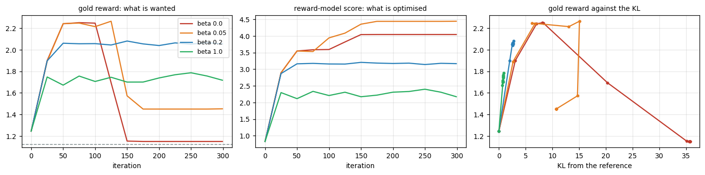
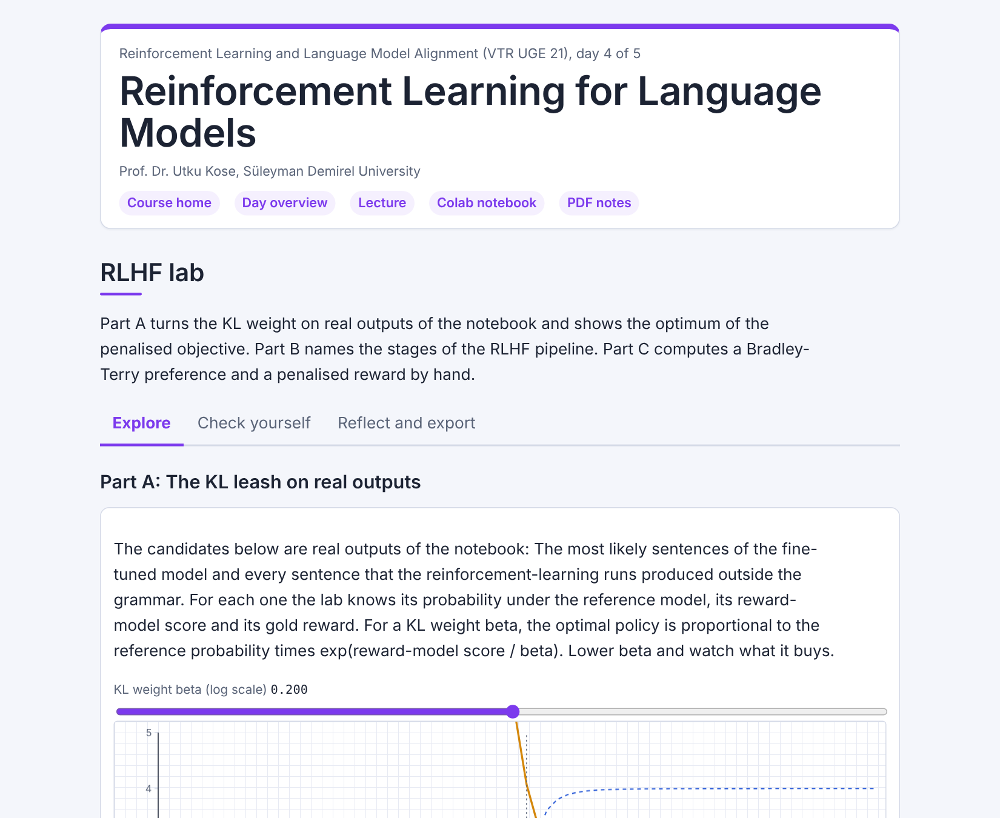

# Day 04: Reinforcement Learning for Language Models

**Reinforcement Learning and Language Model Alignment (VTR UGE 21)**  
Prof. Dr. Utku Kose, Süleyman Demirel University

   

From a language model to an aligned one: fine-tuning, preferences, a learned reward, RLHF with a KL penalty, and what happens without it. **Estimated study time:** 6 to 8 hours.

## Materials of the day

Each material has its own role. Start with the lecture page; the study path below gives the order and the time of each step.

| Material | What it holds | Open |
|---|---|---|
| Lecture page | The concepts of the day, with animations, knowledge checks, review cards and the references | [Lecture page](https://utkukose.github.io/rl-alignment-veltech-NB-lecture/days/day-04/lecture.html) |
| Colab notebook | Python step 4: Text as integers, then the hands-on sections with exercises, an application switch and the application challenges |  |
| Interactive lab | RLHF lab: Three practice parts, a self-assessment and an exportable learning log | [Interactive lab](https://utkukose.github.io/rl-alignment-veltech-NB-lecture/days/day-04/lab.html) |
| PDF lecture notes | The lecture and the Python step in one printable file | [PDF notes](Day04_Lecture_Notes.pdf) |

<table><tr><td width="50%"> From the Colab notebook</td><td width="50%"> The interactive lab</td></tr></table>

## Learning outcomes

By the end of the day, students are expected to train an autoregressive language model and sample from it, to verify its gradient, to generate preference pairs with a noisy annotator and fit a Bradley-Terry reward model, to explain why a held-out accuracy on noisy labels understates the quality of a reward model, to implement RLHF as REINFORCE with a KL penalty, to recognise reward hacking from the divergence of the reward-model score and the gold reward, and to choose the KL weight by measurement. In Python, students are expected to turn text into integer sequences and back, pad them into arrays and sample from a probability vector.

## Study path

| Step | Activity | Suggested time |
|---|---|---|
| 1 | Read the [lecture page](https://utkukose.github.io/rl-alignment-veltech-NB-lecture/days/day-04/lecture.html) and answer its knowledge checks | 1 hour 30 minutes |
| 2 | Work through parts A, B and C of the [interactive lab](https://utkukose.github.io/rl-alignment-veltech-NB-lecture/days/day-04/lab.html) | 45 minutes |
| 3 | Run Python step 4: Text as integers in the [Colab notebook](https://colab.research.google.com/github/utkukose/rl-alignment-veltech-NB-lecture/blob/main/days/day-04/NB04_rl_for_language_models.ipynb#scrollTo=python-step), right after the setup cell | 1 hour |
| 4 | Work through the numbered sections of the notebook and their exercises | 2 hours 30 minutes |
| 5 | Use the application switch of the notebook and solve the application challenge of your field | 45 minutes |
| 6 | Take the self-assessment in the [interactive lab](https://utkukose.github.io/rl-alignment-veltech-NB-lecture/days/day-04/lab.html) (tab: Check yourself) | 20 minutes |
| 7 | Write the reflection in the lab, export the learning log and complete the daily task below | 45 minutes |

## Live session plan

The day runs as one synchronous session in class or online, and each material has one role in it. The lecture page is on the screen, and at each orange Colab box the instructor shows the matching section in a copy of the notebook that has already been run. Students work in their own copy of the notebook from top to bottom, and each lab part follows the lecture part it practises. The PDF lecture notes serve reading after the session, and the study path above serves self-paced study.

| Time | Activity |
|---|---|
| 0:00 to 0:10 | Opening: Recap of Day 3 and the bridge from TokenWorld to language models. Students open the notebook in Colab, save a copy and run section 0 |
| 0:10 to 0:45 | Lecture page, part 1: A small language model, fine-tuning, preferences with the noise animation, the Bradley-Terry reward model |
| 0:45 to 1:10 | Colab, together: Python step 4, ending with the log-probability of a sentence |
| 1:10 to 1:20 | Break |
| 1:20 to 1:55 | Lecture page, part 2: RLHF with a KL penalty, reward hacking with the KL-leash animation; then lab Part C by hand and Part B with the whole class |
| 1:55 to 2:40 | Colab, in pairs: Sections 1 to 7 with their exercises, then section 8 with a different annotator for each pair |
| 2:40 to 3:00 | Lab and closing: Part A, the KL leash on real outputs, and the question of who writes the gold reward in a real project, then the self-assessment; after the session: The PDF notes, the daily task and the optional section 9 |

## Daily task and submission

Add a feature to the reward model that lets it detect repeated words, for example the number of distinct words divided by the number of words. Retrain it, repeat the beta sweep of section 7 and report in about 200 words whether reward hacking disappears, changes form or remains.

The task is optional and supports self-learning and a personal portfolio. During an active delivery of the course, it can be sent together with the exported learning log to utkukose@sdu.edu.tr or utkukose@gmail.com.

## Research and report assignment (optional)

**Reward hacking in RLHF.** Review the evidence on reward hacking and reward-model overoptimisation in language models &#91;[5](https://utkukose.github.io/rl-alignment-veltech-NB-lecture/days/day-04/lecture.html#ref-5), [6](https://utkukose.github.io/rl-alignment-veltech-NB-lecture/days/day-04/lecture.html#ref-6), [9](https://utkukose.github.io/rl-alignment-veltech-NB-lecture/days/day-04/lecture.html#ref-9), [10](https://utkukose.github.io/rl-alignment-veltech-NB-lecture/days/day-04/lecture.html#ref-10)&#93;. Classify the reported hacks by the blind spot they exploit and the mitigation that was proposed. The report should be about 1500 words with at least eight sources.
