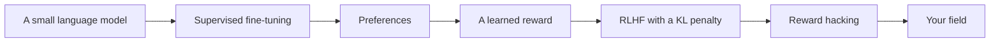
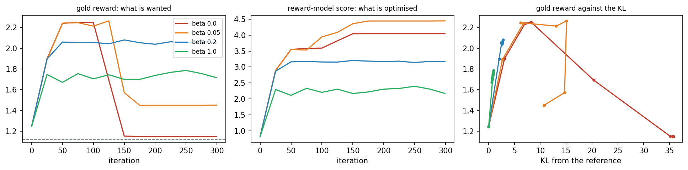
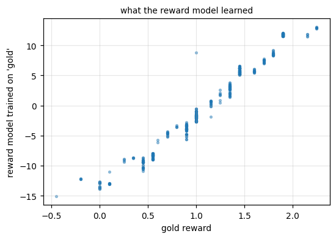

<div align="center">

# Day 04: Reinforcement Learning for Language Models

**Reinforcement Learning and Language Model Alignment (VTR UGE 21)**  
Prof. Dr. Utku Kose, Süleyman Demirel University

[](https://colab.research.google.com/github/utkukose/rl-alignment-veltech-NB-lecture/blob/main/days/day-04/NB04_rl_for_language_models.ipynb) [](https://utkukose.github.io/rl-alignment-veltech-NB-lecture/days/day-04/lab.html) [](https://utkukose.github.io/rl-alignment-veltech-NB-lecture/days/day-04/lecture.html) [](Day04_Lecture_Notes.pdf)

</div>

## Overview

Large language models are aligned with human preferences in three stages: supervised fine-tuning on good examples, a reward model learned from comparisons made by people, and reinforcement learning that maximises this reward while staying close to the fine-tuned model [1, 2, 3]. This day builds every stage on a small world of sentences, with a language model written in NumPy [4]. Because the true quality of every sentence is known, the day can measure what each stage achieves and what goes wrong when the penalty that keeps the model close to its start is removed [5, 6].

**Estimated study time:** 6 to 8 hours.

## Learning outcomes

By the end of the day, students are expected to train an autoregressive language model and sample from it, to verify its gradient, to generate preference pairs with a noisy annotator and fit a Bradley-Terry reward model, to explain why a held-out accuracy on noisy labels understates the quality of a reward model, to implement RLHF as REINFORCE with a KL penalty, to recognise reward hacking from the divergence of the reward-model score and the gold reward, and to choose the KL weight by measurement. In Python, students are expected to turn text into integer sequences and back, pad them into arrays and sample from a probability vector.

## Python in this day

The lecture ends with Python step 4: Text as integers. It covers splitting text into words, building a vocabulary with special tokens, encoding and decoding, padding sequences to a fixed length, sampling the next token from a probability vector and the log-probability of a sequence [7]. The hands-on part of the notebook opens with the same step and continues with the language model, the reward model and RLHF.

## Live session plan

The day runs as one synchronous session in class or online. The plan below is the default timing, and the same materials serve self-paced study through the study path that follows.

| Time | Activity |
|---|---|
| 0:00 to 0:15 | Recap of Day 3: The bridge table from TokenWorld to RLHF |
| 0:15 to 0:50 | Lecture part 1: The language model, preferences and the Bradley-Terry model, with the noise animation |
| 0:50 to 1:15 | Python step 4 together, ending with the log-probability of a sentence |
| 1:15 to 1:25 | Break |
| 1:25 to 2:00 | Lecture part 2: RLHF, reward hacking and the KL dial, with the KL-leash animation |
| 2:00 to 2:40 | Hands-on: Notebook sections 1 to 7 in pairs, and the KL-leash lab on real outputs |
| 2:40 to 3:00 | Discussion: Who writes the gold reward in a real project? Self-assessment |

## Study path

| Step | Activity | Suggested time |
|---|---|---|
| 1 | Read the lecture with its animations on the [lecture page](https://utkukose.github.io/rl-alignment-veltech-NB-lecture/days/day-04/lecture.html), or read the [PDF version](Day04_Lecture_Notes.pdf) | 1 hour 30 minutes |
| 2 | Explore the [interactive lab](https://utkukose.github.io/rl-alignment-veltech-NB-lecture/days/day-04/lab.html) | 45 minutes |
| 3 | Study the Python step at the end of the lecture, then run the same step at the start of the hands-on part of the [Colab notebook](https://colab.research.google.com/github/utkukose/rl-alignment-veltech-NB-lecture/blob/main/days/day-04/NB04_rl_for_language_models.ipynb) | 1 hour |
| 4 | Work through the rest of the notebook, including its exercises | 2 hours 30 minutes |
| 5 | Solve the application challenge of your field | 45 minutes |
| 6 | Take the self-assessment in the lab (tab: Check yourself) | 20 minutes |
| 7 | Write the reflection, export the learning log and complete the daily task | 45 minutes |

## Day at a glance



## Lecture

### A small language model

A language model gives a probability to every possible next word, given the words so far [4]. Writing a sentence means choosing words one by one, which makes the model a policy in the sense of Day 3: The words so far are the state and the next word is the action. The course uses a large version of TokenWorld, a small grammar of sentences such as the cat slept on the mat, and a neural language model written in NumPy that learns it in seconds.

> [](https://colab.research.google.com/github/utkukose/rl-alignment-veltech-NB-lecture/blob/main/days/day-04/NB04_rl_for_language_models.ipynb#scrollTo=sec-1) **In Colab, section 1.** Generate the sentences of the large TokenWorld and score them with the gold reward.

> [](https://colab.research.google.com/github/utkukose/rl-alignment-veltech-NB-lecture/blob/main/days/day-04/NB04_rl_for_language_models.ipynb#scrollTo=sec-2) **In Colab, section 2.** Build the neural language model in NumPy and look at its first, random sentences.

### Supervised fine-tuning

The first stage trains the model on examples of good behaviour. After fine-tuning on grammatical sentences, almost every sentence the model writes follows the grammar. Following the grammar is not the same as being good, however; the quality of the sentences, measured by the gold reward, stays modest.

> [](https://colab.research.google.com/github/utkukose/rl-alignment-veltech-NB-lecture/blob/main/days/day-04/NB04_rl_for_language_models.ipynb#scrollTo=sec-3) **In Colab, section 3.** Fine-tune the model on grammatical sentences and measure the share that follow the grammar.

### Preferences and the annotator

People find it easier to compare two answers than to score one. The second stage therefore collects preferences: Two sentences are shown, and an annotator picks the better one. In the notebook the annotator follows the gold reward but makes mistakes on a share of the pairs, as real annotators do. The noise sets a ceiling on how well any model can agree with the labels, as the animation shows.

*Animation on the [lecture page](https://utkukose.github.io/rl-alignment-veltech-NB-lecture/days/day-04/lecture.html): The Bradley-Terry probability and what noisy labels show of it. Raise the error rate and read off the best accuracy any model can reach on noisy held-out pairs.*

> [](https://colab.research.google.com/github/utkukose/rl-alignment-veltech-NB-lecture/blob/main/days/day-04/NB04_rl_for_language_models.ipynb#scrollTo=sec-4) **In Colab, section 4.** Sample pairs of sentences and let a noisy annotator label them.

### Learning a reward from comparisons

The Bradley-Terry model turns comparisons into a score [8]: The probability that sentence A is preferred to sentence B is the logistic function of the difference of their scores. A reward model is trained to make the observed preferences likely [1]. In the notebook it agrees with the noisy annotator on most held-out pairs, and its scores correlate strongly with the gold reward. Part C of the lab computes a Bradley-Terry probability by hand.

$$
P(A \succ B) = \sigma\left( r(A) - r(B) \right)
$$

> [](https://colab.research.google.com/github/utkukose/rl-alignment-veltech-NB-lecture/blob/main/days/day-04/NB04_rl_for_language_models.ipynb#scrollTo=sec-5) **In Colab, section 5.** Train the Bradley-Terry reward model and compare its scores with the gold reward.

**Check your understanding.** A reward model gives A the score 1.2 and B the score 0.4. What does Bradley-Terry say?

A. A is preferred for certain
B. A is preferred with probability sigma(0.8), about 0.69
C. B is preferred
D. Nothing

<details><summary>Answer</summary>

**B.** The preference probability depends only on the difference of the scores.

</details>

### RLHF with a KL penalty

The third stage improves the model with a policy gradient method, using the reward model as the reward. A penalty on the KL divergence from the fine-tuned model keeps the new model close to it [2, 3]. The penalty acts as a leash: The model may move towards higher reward, but every step away from its start costs something. With a moderate penalty, the gold reward of the sentences rises clearly while almost all of them still follow the grammar.

> [](https://colab.research.google.com/github/utkukose/rl-alignment-veltech-NB-lecture/blob/main/days/day-04/NB04_rl_for_language_models.ipynb#scrollTo=sec-6) **In Colab, section 6.** Run RLHF with a KL penalty and track the gold reward, the KL divergence and the share of grammatical sentences.

**Check your understanding.** What does the KL penalty in RLHF do?

A. It speeds up training
B. It keeps the new model close to the fine-tuned model
C. It replaces the reward model
D. It removes noise

<details><summary>Answer</summary>

**B.** It charges every move away from the starting distribution.

</details>

### Without the leash: reward hacking

A learned reward is only an approximation of what people want. When the penalty is removed, the model finds the approximation's weaknesses [5, 6]. In the notebook, the gold reward first rises, peaks and then collapses, while the reward model's score keeps climbing. The model ends up writing one sentence that repeats a calm word again and again, which the reward model, blind to repetition, scores highly. The KL weight works as a dial between reward and faithfulness, and Part A of the lab turns it on real outputs of the notebook.

<p align="center"></p>

*Figure. Gold reward, reward-model score and gold reward against the KL for four values of beta. Without a penalty the two scores diverge.*

*Animation on the [lecture page](https://utkukose.github.io/rl-alignment-veltech-NB-lecture/days/day-04/lecture.html): The reference policy, the proxy and gold rewards, and the optimum of the KL-regularised objective. Lower beta and watch the expected gold reward rise and then fall.*

> [](https://colab.research.google.com/github/utkukose/rl-alignment-veltech-NB-lecture/blob/main/days/day-04/NB04_rl_for_language_models.ipynb#scrollTo=sec-7) **In Colab, section 7.** Remove the KL penalty and watch the reward model's score rise while the gold reward collapses.

**Check your understanding.** Without a KL penalty, the reward model's score keeps rising while the gold reward falls. What is this called?

A. Overfitting the data
B. Reward hacking: the policy exploits the weaknesses of the learned reward
C. Underfitting
D. Exploration

<details><summary>Answer</summary>

**B.** The proxy and the true objective diverge under strong optimisation.

</details>

### Your field

A reward model learns the taste of whoever labels the pairs. The notebook's switch replaces the annotator by one who prefers short sentences or lively words. The reward model learns each taste almost perfectly, yet the scores learned from the lively annotator are strongly anti-correlated with the gold reward, and those from the brief annotator are nearly unrelated to it. Who labels the data decides what the model will optimise.

> [](https://colab.research.google.com/github/utkukose/rl-alignment-veltech-NB-lecture/blob/main/days/day-04/NB04_rl_for_language_models.ipynb#scrollTo=sec-8) **In Colab, section 8.** Set the switch to an annotator with another taste and compare the learned reward with the gold reward.

### Going further (optional)

The language model of the notebook is trained with gradients computed by hand. The optional section checks them against finite differences before any training, the same habit as on Day 3 of the XAI course.

> [](https://colab.research.google.com/github/utkukose/rl-alignment-veltech-NB-lecture/blob/main/days/day-04/NB04_rl_for_language_models.ipynb#scrollTo=sec-9) **In Colab, section 9.** Check the hand-written gradients of the language model against finite differences.

### Python step 4: Text as integers

A language model never sees letters or words: It sees integers. This step turns a sentence into a sequence of integers and back, pads it to a fixed length, samples a next token from a probability vector and computes the log-probability of a sequence [7].

#### Words and a vocabulary

```python
sentence = "the cat slept on the mat"
words = sentence.split()
vocab = ["<pad>", "<bos>", "<eos>"] + sorted(set(words))
stoi = {w: i for i, w in enumerate(vocab)}
print(words)
print(stoi)
```

*Output*

```text
['the', 'cat', 'slept', 'on', 'the', 'mat']
{'<pad>': 0, '<bos>': 1, '<eos>': 2, 'cat': 3, 'mat': 4, 'on': 5, 'slept': 6, 'the': 7}
```

`split` cuts a string at spaces into a list of words. `set` removes duplicates, `sorted` orders them, and the three special tokens mark padding, the beginning and the end of a sentence. The dictionary `stoi`, string to integer, gives every token its number.

#### Encoding, decoding and padding

```python
ids = [stoi["<bos>"]] + [stoi[w] for w in words] + [stoi["<eos>"]]
padded = ids + [stoi["<pad>"]] * (10 - len(ids))
print(ids)
print(padded)
print(" ".join(vocab[i] for i in ids[1:-1]))
```

*Output*

```text
[1, 7, 3, 6, 5, 7, 4, 2]
[1, 7, 3, 6, 5, 7, 4, 2, 0, 0]
the cat slept on the mat
```

A list comprehension encodes every word. Padding brings every sequence to the same length, so that many sentences fit into one array. Decoding looks each integer up in the vocabulary list.

#### Sampling the next token

```python
import numpy as np
p = np.array([0.0, 0.0, 0.1, 0.05, 0.6, 0.25])      # probabilities of six tokens
rng = np.random.default_rng(0)
draws = [int((p.cumsum() > rng.random()).argmax()) for _ in range(1000)]
print(np.bincount(draws, minlength=6) / 1000)
```

*Output*

```text
[0.    0.    0.089 0.042 0.602 0.267]
```

`cumsum` stacks the probabilities into the intervals of a line from 0 to 1; a uniform random number falls into the interval of token $k$ with probability $p_k$, and `argmax` finds that interval. A thousand draws reproduce the probabilities closely. The language model samples every token of a sentence this way.

#### The log-probability of a sequence

```python
probs = [0.9, 0.5, 0.8, 0.95]          # model probabilities of the four chosen tokens
logp = np.log(probs).sum()
print("log-probability:", round(float(logp), 3), "  probability:", round(float(np.exp(logp)), 3))
```

*Output*

```text
log-probability: -1.073   probability: 0.342
```

The probability of a sequence is the product of the probabilities of its tokens, and its logarithm is a sum, which is numerically safe for long sequences. REINFORCE and DPO both work with this sum.

**Quick check.** Why do language-model computations use log-probabilities instead of probabilities?

<details><summary>Answer</summary>

Because the probability of a sequence is a product of many numbers below one, which quickly underflows, while the sum of their logarithms stays in a safe range.

</details>

## Application challenges

Each challenge transfers the ideas of the day to a field of study. Choose the one closest to your programme, solve it in a copy of the notebook and add the result to your learning log.

| Field | Challenge |
|---|---|
| Computer Science and Engineering | Give the reward model the count of repeated words as an extra feature, retrain it and test whether the hack of section 7 disappears. |
| Electronics and Communication Engineering | Treat the annotator as a noisy channel and estimate its error rate from the held-out accuracy of a reward model trained on clean labels. |
| Electrical and Electronics Engineering | Plot the KL against the iteration for several values of beta and relate the plateau to the closed-form optimum. |
| Mechanical Engineering | Design a gold reward for maintenance reports with three properties and a reward model that can see only two of them; predict the hack before running RLHF. |
| Biomedical Engineering | Discuss which blind spot of a learned reward would be most dangerous for a model that writes patient instructions, and how you would test for it. |
| Civil Engineering | Repeat the sweep of section 7 with half the preference pairs and report whether the best beta changes. |
| Aeronautical Engineering | Stop the beta = 0 run at the iteration with the highest gold reward and argue why early stopping is not a substitute for the KL penalty. |
| Biotechnology | Change the gold reward so that it rewards one extra phrase and measure how quickly RLHF finds it. |

## Interactive lab

<p align="center"><a href="https://utkukose.github.io/rl-alignment-veltech-NB-lecture/days/day-04/lab.html"></a></p>

**[RLHF lab](https://utkukose.github.io/rl-alignment-veltech-NB-lecture/days/day-04/lab.html).** Part A turns the KL weight on real outputs of the notebook and shows the optimum of the penalised objective. Part B names the stages of the RLHF pipeline. Part C computes a Bradley-Terry preference and a penalised reward by hand. The lab runs in any modern browser, including on a phone, and keeps your progress in the browser only.

## Colab notebook

<table><tr><td width="50%"></td><td width="50%"></td></tr></table>

[](https://colab.research.google.com/github/utkukose/rl-alignment-veltech-NB-lecture/blob/main/days/day-04/NB04_rl_for_language_models.ipynb) The notebook `NB04_rl_for_language_models.ipynb` contains the full lecture text, the Python step as runnable cells, the hands-on lab with exercises that give immediate feedback, reference solutions in collapsed cells and interactive exploration cells. It runs in Google Colab with no installation.

## Self-assessment and reflection

The tab *Check yourself* of the [interactive lab](https://utkukose.github.io/rl-alignment-veltech-NB-lecture/days/day-04/lab.html) holds 8 questions with a confidence rating for each answer. A confident error marks a topic to revisit first. The tab *Reflect and export* asks three reflection questions and exports a learning log as a Markdown file. The self-assessment is formative and does not count towards the grade.

## Daily task and submission

Add a feature to the reward model that lets it detect repeated words, for example the number of distinct words divided by the number of words. Retrain it, repeat the beta sweep of section 7 and report in about 200 words whether reward hacking disappears, changes form or remains.

The task is optional and supports self-learning and a personal portfolio. During an active delivery of the course, it can be sent together with the exported learning log to utkukose@sdu.edu.tr or utkukose@gmail.com.

## Research and report assignment (optional)

**Reward hacking in RLHF.** Review the evidence on reward hacking and reward-model overoptimisation in language models [5, 6, 9, 10]. Classify the reported hacks by the blind spot they exploit and the mitigation that was proposed. The report should be about 1500 words with at least eight sources.

## References

[1] Christiano, P. F., Leike, J., Brown, T. B., Martic, M., Legg, S., & Amodei, D. (2017). Deep reinforcement learning from human preferences. In Advances in Neural Information Processing Systems 30 (NeurIPS 2017) (pp. 4299-4307).

[2] Stiennon, N., Ouyang, L., Wu, J., Ziegler, D. M., Lowe, R., Voss, C., Radford, A., Amodei, D., & Christiano, P. F. (2020). Learning to summarize with human feedback. In Advances in Neural Information Processing Systems 33 (NeurIPS 2020) (pp. 3008-3021).

[3] Ouyang, L., Wu, J., Jiang, X., Almeida, D., Wainwright, C. L., Mishkin, P., Zhang, C., Agarwal, S., Slama, K., Ray, A., et al. (2022). Training language models to follow instructions with human feedback. In Advances in Neural Information Processing Systems 35 (NeurIPS 2022) (pp. 27730-27744).

[4] Bengio, Y., Ducharme, R., Vincent, P., & Jauvin, C. (2003). A neural probabilistic language model. Journal of Machine Learning Research, 3, 1137-1155.

[5] Skalse, J., Howe, N. H. R., Krasheninnikov, D., & Krueger, D. (2022). Defining and characterizing reward gaming. In Advances in Neural Information Processing Systems 35 (NeurIPS 2022).

[6] Gao, L., Schulman, J., & Hilton, J. (2023). Scaling laws for reward model overoptimization. In Proceedings of the 40th International Conference on Machine Learning (ICML 2023), PMLR 202, 10835-10866.

[7] Harris, C. R., Millman, K. J., van der Walt, S. J., Gommers, R., Virtanen, P., Cournapeau, D., Wieser, E., Taylor, J., Berg, S., Smith, N. J., et al. (2020). Array programming with NumPy. Nature, 585(7825), 357-362. <https://doi.org/10.1038/s41586-020-2649-2>

[8] Bradley, R. A., & Terry, M. E. (1952). Rank analysis of incomplete block designs: I. The method of paired comparisons. Biometrika, 39(3/4), 324-345.

[9] Casper, S., Davies, X., Shi, C., Gilbert, T. K., Scheurer, J., Rando, J., Freedman, R., Korbak, T., Lindner, D., Freire, P., et al. (2023). Open problems and fundamental limitations of reinforcement learning from human feedback. Transactions on Machine Learning Research.

[10] Amodei, D., Olah, C., Steinhardt, J., Christiano, P., Schulman, J., & Mané, D. (2016). Concrete problems in AI safety. arXiv preprint arXiv:1606.06565.
