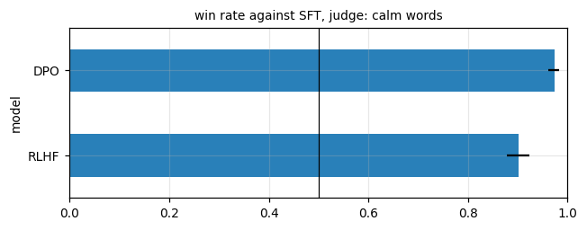
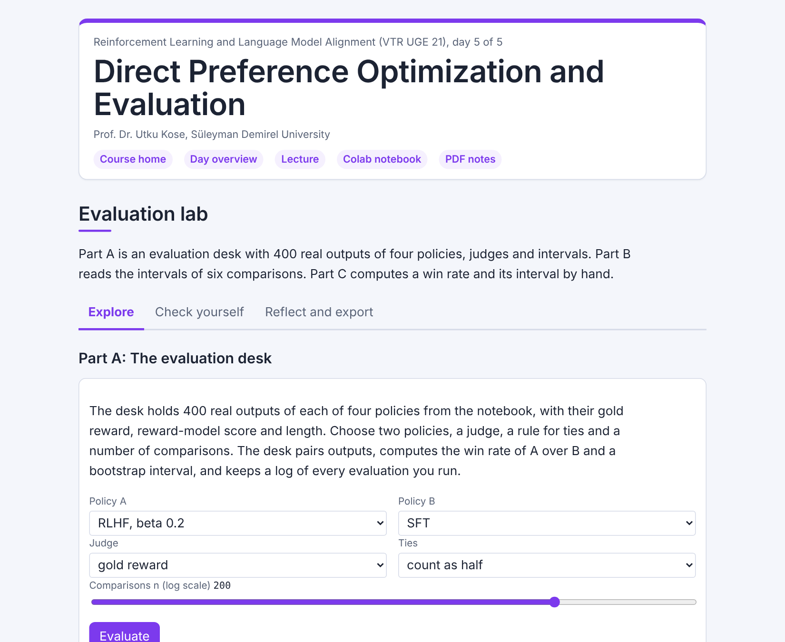

# Day 05: Direct Preference Optimization and Evaluation

**Reinforcement Learning and Language Model Alignment (VTR UGE 21)**  
Prof. Dr. Utku Kose, Süleyman Demirel University

   

Preference optimisation without a reward model or sampling, compared with reinforcement learning from human feedback (RLHF) on matched data, and the evaluation of aligned models with judges, intervals and seeds. **Estimated study time:** 6 to 8 hours.

## Materials of the day

Each material has its own role. Start with the lecture page; the study path below gives the order and the time of each step.

| Material | What it holds | Open |
|---|---|---|
| Lecture page | The concepts of the day, with animations, knowledge checks, review cards and the references | [Lecture page](https://utkukose.github.io/rl-alignment-veltech-NB-lecture/days/day-05/lecture.html) |
| Colab notebook | Python step 5: Objects, copies and intervals, then the hands-on sections with exercises, an application switch and the application challenges |  |
| Interactive lab | Evaluation lab: Three practice parts, a self-assessment and an exportable learning log | [Interactive lab](https://utkukose.github.io/rl-alignment-veltech-NB-lecture/days/day-05/lab.html) |
| PDF lecture notes | The lecture and the Python step in one printable file | [PDF notes](Day05_Lecture_Notes.pdf) |

<table><tr><td width="50%"> From the Colab notebook</td><td width="50%"> The interactive lab</td></tr></table>

## Learning outcomes

By the end of the day, students are expected to derive the loss of direct preference optimisation (DPO) from the optimum of the RLHF objective with its Kullback-Leibler (KL) penalty and from the Bradley-Terry model, to implement it and explain the role of its gradient weight, to compare DPO with RLHF on gold reward, KL divergence and the quality of the outputs and explain the drift of DPO for small values of its parameter beta, to evaluate aligned models with several judges and recognise a judge that measures a surface property, to treat ties and report bootstrap intervals, and to plan the number of comparisons and seeds needed for a decision. In Python, students are expected to distinguish an alias from a copy of an object, to compute a bootstrap interval and to write a function that returns a dictionary of results.

## Study path

| Step | Activity | Suggested time |
|---|---|---|
| 1 | Read the [lecture page](https://utkukose.github.io/rl-alignment-veltech-NB-lecture/days/day-05/lecture.html) and answer its knowledge checks | 1 hour 30 minutes |
| 2 | Work through parts A, B and C of the [interactive lab](https://utkukose.github.io/rl-alignment-veltech-NB-lecture/days/day-05/lab.html) | 45 minutes |
| 3 | Run Python step 5: Objects, copies and intervals in the [Colab notebook](https://colab.research.google.com/github/utkukose/rl-alignment-veltech-NB-lecture/blob/main/days/day-05/NB05_dpo_and_evaluation.ipynb#scrollTo=python-step), right after the setup cell | 1 hour |
| 4 | Work through the numbered sections of the notebook and their exercises | 2 hours 30 minutes |
| 5 | Use the application switch of the notebook and solve the application challenge of your field | 45 minutes |
| 6 | Take the self-assessment in the [interactive lab](https://utkukose.github.io/rl-alignment-veltech-NB-lecture/days/day-05/lab.html) (tab: Check yourself) | 20 minutes |
| 7 | Write the reflection in the lab, export the learning log and complete the daily task below | 45 minutes |

## Live session plan

The day runs as one synchronous session in class or online, and each material has one role in it. The lecture page is on the screen, and at each orange Colab box the instructor shows the matching section in a copy of the notebook that has already been run. Students work in their own copy of the notebook from top to bottom, and each lab part follows the lecture part it practises. The PDF lecture notes serve reading after the session, and the study path above serves self-paced study.

| Time | Activity |
|---|---|
| 0:00 to 0:10 | Opening: Recap of Day 4 and the question of the day: Is the reward model needed at all? Students open the notebook in Colab, save a copy and run section 0 |
| 0:10 to 0:45 | Lecture page, part 1: From the optimum to DPO with the gradient-weight animation, DPO against RLHF on matched data |
| 0:45 to 1:10 | Colab, together: Python step 5, ending with a bootstrap interval |
| 1:10 to 1:20 | Break |
| 1:20 to 1:55 | Lecture page, part 2: Judges and their biases, intervals, sample size and seeds with the sample-size animation; then lab Part B with the whole class and Part C by hand |
| 1:55 to 2:30 | Colab, in pairs: Sections 1 to 5 with their exercises, then section 6 with a different judge for each pair |
| 2:30 to 3:00 | Lab and closing: Part A, the evaluation desk, then open problems, section 7 with the final project, questions and the course evaluation |

## Daily task and submission

Compare RLHF and DPO over at least three seeds each, with the gold judge and ties counted as half. Report the mean win rate of each method against the model after supervised fine-tuning (SFT) with an interval over seeds, together with the KL divergence and the share of grammatical outputs. Write about 200 words on which method you would choose and why.

The task is optional and supports self-learning and a personal portfolio. During an active delivery of the course, it can be sent together with the exported learning log to utkukose@sdu.edu.tr or utkukose@gmail.com.

## Research and report assignment (optional)

**Direct preference optimisation and its variants.** Review direct preference optimisation and the variants proposed since, including identity preference optimisation (IPO) and Kahneman-Tversky optimisation (KTO) &#91;[1](https://utkukose.github.io/rl-alignment-veltech-NB-lecture/days/day-05/lecture.html#ref-1), [12](https://utkukose.github.io/rl-alignment-veltech-NB-lecture/days/day-05/lecture.html#ref-12), [13](https://utkukose.github.io/rl-alignment-veltech-NB-lecture/days/day-05/lecture.html#ref-13)&#93;, and the evidence on how they compare with RLHF. Pay attention to how the comparisons were evaluated. The report should be about 1500 words with at least eight sources.
