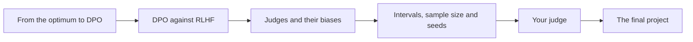
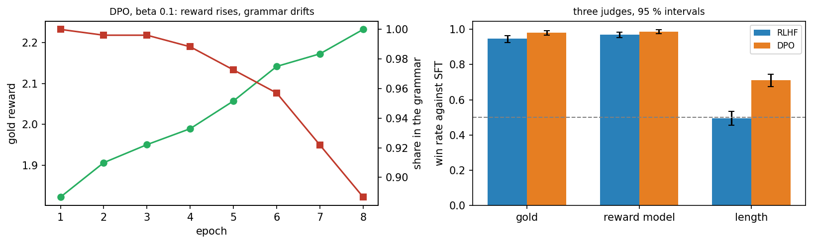

<div align="center">

# Day 05: Direct Preference Optimization and Evaluation

**Reinforcement Learning and Language Model Alignment (VTR UGE 21)**  
Prof. Dr. Utku Kose, Süleyman Demirel University

[](https://colab.research.google.com/github/utkukose/rl-alignment-veltech-NB-lecture/blob/main/days/day-05/NB05_dpo_and_evaluation.ipynb) [](https://utkukose.github.io/rl-alignment-veltech-NB-lecture/days/day-05/lab.html) [](https://utkukose.github.io/rl-alignment-veltech-NB-lecture/days/day-05/lecture.html) [](Day05_Lecture_Notes.pdf)

</div>

## Overview

RLHF needs a reward model, sampling during training and careful tuning. Direct preference optimisation reaches the same goal with a simple classification loss on the preference pairs themselves [1]. This day derives the idea, compares DPO with RLHF on exactly the same data, and then turns to a question that is harder than it looks: how to tell whether one aligned model is better than another. It compares judges and their biases [2, 3], puts intervals around every win rate and asks how many comparisons and seeds a claim needs [4].

**Estimated study time:** 6 to 8 hours.

## Learning outcomes

By the end of the day, students are expected to derive the DPO loss from the KL-regularised optimum and the Bradley-Terry model, to implement it and explain the role of its gradient weight, to compare DPO with RLHF on gold reward, KL and the quality of the outputs and explain the drift of DPO for small beta, to evaluate aligned models with several judges and recognise a judge that measures a surface property, to treat ties and report bootstrap intervals, and to plan the number of comparisons and seeds needed for a decision. In Python, students are expected to distinguish an alias from a copy of an object, to compute a bootstrap interval and to write a function that returns a dictionary of results.

## Python in this day

The lecture ends with Python step 5: Objects, copies and intervals. It covers how two names can refer to one object and why the reference policy must be a copy, a bootstrap interval for a win rate and a function that returns a dictionary of results [5, 6]. The hands-on part of the notebook opens with the same step and continues with DPO and the evaluation.

## Live session plan

The day runs as one synchronous session in class or online. The plan below is the default timing, and the same materials serve self-paced study through the study path that follows.

| Time | Activity |
|---|---|
| 0:00 to 0:15 | Recap of Day 4: The closed-form optimum, and the question of whether the reward model is needed at all |
| 0:15 to 0:50 | Lecture part 1: The derivation of DPO, its gradient weight with the animation, DPO against RLHF |
| 0:50 to 1:15 | Python step 5 together, ending with a bootstrap interval |
| 1:15 to 1:25 | Break |
| 1:25 to 2:00 | Lecture part 2: Judges, ties, intervals and seeds, with the sample-size animation |
| 2:00 to 2:35 | Hands-on: Notebook sections 1 to 6 in pairs, and the evaluation desk of the lab |
| 2:35 to 3:00 | Open problems, the final project briefing and the course evaluation |

## Study path

| Step | Activity | Suggested time |
|---|---|---|
| 1 | Read the lecture with its animations on the [lecture page](https://utkukose.github.io/rl-alignment-veltech-NB-lecture/days/day-05/lecture.html), or read the [PDF version](Day05_Lecture_Notes.pdf) | 1 hour 30 minutes |
| 2 | Explore the [interactive lab](https://utkukose.github.io/rl-alignment-veltech-NB-lecture/days/day-05/lab.html) | 45 minutes |
| 3 | Study the Python step at the end of the lecture, then run the same step at the start of the hands-on part of the [Colab notebook](https://colab.research.google.com/github/utkukose/rl-alignment-veltech-NB-lecture/blob/main/days/day-05/NB05_dpo_and_evaluation.ipynb) | 1 hour |
| 4 | Work through the rest of the notebook, including its exercises | 2 hours 30 minutes |
| 5 | Solve the application challenge of your field | 45 minutes |
| 6 | Take the self-assessment in the lab (tab: Check yourself) | 20 minutes |
| 7 | Write the reflection, export the learning log and complete the daily task | 45 minutes |

## Day at a glance



## Lecture

### From the optimum to DPO

The objective of RLHF, reward minus a KL penalty, has a known optimum: The best policy is the fine-tuned model reweighted by the exponential of the reward. Rafailov and colleagues turned this around [1]. If the optimal policy determines the reward, the reward can be written in terms of the policy, and the Bradley-Terry likelihood of the preferences becomes a loss on the policy itself. Direct preference optimisation trains the model on the preference pairs with this loss, without a separate reward model and without sampling new answers during training. Its parameter beta plays the role of the KL weight.

*Animation on the [lecture page](https://utkukose.github.io/rl-alignment-veltech-NB-lecture/days/day-05/lecture.html): The DPO loss and its gradient weight against the implicit reward margin of a pair. Change beta and move the margin.*

> [](https://colab.research.google.com/github/utkukose/rl-alignment-veltech-NB-lecture/blob/main/days/day-05/NB05_dpo_and_evaluation.ipynb#scrollTo=sec-1) **In Colab, section 1.** Rebuild the world of Day 4: the fine-tuned model, the preference pairs, the reward model and RLHF.

> [](https://colab.research.google.com/github/utkukose/rl-alignment-veltech-NB-lecture/blob/main/days/day-05/NB05_dpo_and_evaluation.ipynb#scrollTo=sec-2) **In Colab, section 2.** Implement the DPO loss and train the model directly on the preference pairs.

**Check your understanding.** What does DPO need that RLHF also needs?

A. A separate reward model
B. Sampling during training
C. Preference pairs
D. A value function

<details><summary>Answer</summary>

**C.** DPO learns from the pairs directly; it needs neither a reward model nor sampling.

</details>

### DPO against RLHF on matched data

A fair comparison gives both methods the same fine-tuned model and the same pairs. In the notebook, DPO reaches a slightly higher gold reward than RLHF but moves further from the fine-tuned model, and a clearly smaller share of its sentences still follows the grammar. With a smaller beta, DPO drifts so far that most sentences break the grammar. Neither method is better in every respect; the comparison depends on what is measured.

<p align="center"></p>

*Figure. Left: DPO over eight epochs, with the gold reward rising and the share of grammatical outputs falling. Right: Win rates against SFT under three judges, with 95 percent intervals.*

> [](https://colab.research.google.com/github/utkukose/rl-alignment-veltech-NB-lecture/blob/main/days/day-05/NB05_dpo_and_evaluation.ipynb#scrollTo=sec-3) **In Colab, section 3.** Compare DPO and RLHF on matched data: gold reward, distance from the fine-tuned model and grammar.

**Check your understanding.** DPO reaches a higher gold reward than RLHF but breaks the grammar more often. What follows?

A. DPO is better
B. RLHF is better
C. The answer depends on which property matters for the application
D. Both failed

<details><summary>Answer</summary>

**C.** A single number hides the trade-off.

</details>

### Judges and their biases

Aligned models are compared by asking a judge which of two answers is better, and reporting a win rate. The judge may be a person, a reward model or another language model [2]. Judges have biases; a well-known one is a preference for longer answers [3]. In the notebook, a judge that simply prefers longer sentences cannot separate RLHF from the fine-tuned model, yet declares DPO clearly better, partly because DPO writes longer sentences; a judge that prefers short sentences ranks DPO below the fine-tuned model. How ties are counted can also change a conclusion.

> [](https://colab.research.google.com/github/utkukose/rl-alignment-veltech-NB-lecture/blob/main/days/day-05/NB05_dpo_and_evaluation.ipynb#scrollTo=sec-4) **In Colab, section 4.** Compare RLHF and DPO with three judges: the gold reward, the reward model and a judge that counts words.

**Check your understanding.** A judge prefers longer answers. What can it reward?

A. Better answers only
B. Answers that are merely longer
C. Shorter answers
D. Nothing

<details><summary>Answer</summary>

**B.** A length bias makes length look like quality.

</details>

### Intervals, sample size and seeds

A win rate measured on a few hundred comparisons is an estimate with an interval around it. When the interval contains one half, the comparison is undecided. The notebook trains the same recipe twice with different seeds: With 400 comparisons the two runs cannot be told apart; with 1600 they can, with a win rate barely above one half. A claim that one model is better needs its interval, its number of comparisons and more than one seed [4]. Part B of the lab reads intervals, and Part C computes one by hand.

*Animation on the [lecture page](https://utkukose.github.io/rl-alignment-veltech-NB-lecture/days/day-05/lecture.html): The spread of win-rate estimates over 400 simulated experiments. Change the number of comparisons and the true win rate and read off how often an experiment reaches a decision.*

> [](https://colab.research.google.com/github/utkukose/rl-alignment-veltech-NB-lecture/blob/main/days/day-05/NB05_dpo_and_evaluation.ipynb#scrollTo=sec-5) **In Colab, section 5.** Put bootstrap intervals around the win rates and find how many comparisons decide between two seeds.

**Check your understanding.** A win rate is 0.52 with a 95 percent interval from 0.47 to 0.57. What can be concluded?

A. A is better
B. B is better
C. The comparison is undecided
D. The judge is biased

<details><summary>Answer</summary>

**C.** The interval contains one half.

</details>

### Your judge

The notebook's switch lets you define the judge: one that counts calm words, one that prefers short sentences, one that punishes repetition or one that only checks the opening word. The same two models win clearly under the first judge, lose under the second and third, and tie almost always under the fourth, because it cannot tell the answers apart. A win rate means nothing without its judge.

> [](https://colab.research.google.com/github/utkukose/rl-alignment-veltech-NB-lecture/blob/main/days/day-05/NB05_dpo_and_evaluation.ipynb#scrollTo=sec-6) **In Colab, section 6.** Set the switch to a judge of your choice and compare RLHF and DPO against the fine-tuned model.

### Open problems and the final project

Alignment by preferences leaves open questions: whose preferences are collected, how judges can be checked, how a model behaves outside the data it was tuned on, and how to detect reward hacking that a learned reward cannot see [7]. The final project asks for a small alignment study of your own, with every element of the week: a world with a known gold reward, a preference method, an honest evaluation with intervals and seeds, and a discussion of what the gold reward does not capture.

> [](https://colab.research.google.com/github/utkukose/rl-alignment-veltech-NB-lecture/blob/main/days/day-05/NB05_dpo_and_evaluation.ipynb#scrollTo=sec-7) **In Colab, section 7.** Read the brief of the final project and the rubric.

### Python step 5: Objects, copies and intervals

Two practical details decide whether an alignment experiment is valid: The reference model must stay frozen while the policy changes, and every win rate needs an interval. This step shows both in plain Python and NumPy [5, 6].

#### An alias is not a copy

```python
import copy
class Policy:
    def __init__(self, weights):
        self.weights = weights

pol = Policy([1.0, 2.0])
alias = pol                     # a second name for the same object
frozen = copy.deepcopy(pol)     # an independent object with the same content
pol.weights[0] = 99.0
print("alias :", alias.weights)
print("frozen:", frozen.weights)
```

*Output*

```text
alias : [99.0, 2.0]
frozen: [1.0, 2.0]
```

Assignment in Python never copies an object; it gives the object another name. A reference policy created by `ref = pol` would change with every update of the policy, and its KL to the policy would always be zero. `copy.deepcopy`, or the `copy` method of the language model in the notebook, creates an independent object.

#### A bootstrap interval

```python
import numpy as np
wins = np.array([1, 1, 0, 1, 1, 0, 1, 1, 1, 0] * 10, float)    # 100 comparisons, 70 wins
rng = np.random.default_rng(0)
boot = rng.choice(wins, (2000, len(wins))).mean(axis=1)        # 2000 resampled win rates
print("win rate:", wins.mean(), "  95 % interval:", np.percentile(boot, [2.5, 97.5]).round(3))
```

*Output*

```text
win rate: 0.7   95 % interval: [0.61 0.79]
```

`rng.choice(wins, (2000, 100))` draws 2000 rows of 100 comparisons with replacement, and the mean of each row is one resampled win rate. The 2.5th and 97.5th percentiles of these values bound the 95 percent interval.

#### A function that returns a dictionary

```python
def summarise(outcomes, n_boot=2000, seed=0):
    """Win rate of a series of comparisons, with its bootstrap interval."""
    outcomes = np.asarray(outcomes, float)
    boot = np.random.default_rng(seed).choice(outcomes, (n_boot, len(outcomes))).mean(1)
    low, high = np.percentile(boot, [2.5, 97.5])
    return {"win_rate": float(outcomes.mean()), "low": float(low), "high": float(high), "n": len(outcomes)}

for n in (20, 100):
    s = summarise(wins[:n])
    print(f"n = {s['n']:3d}: win rate {s['win_rate']:.2f}, interval [{s['low']:.2f}, {s['high']:.2f}]")
```

*Output*

```text
n =  20: win rate 0.70, interval [0.50, 0.90]
n = 100: win rate 0.70, interval [0.61, 0.79]
```

Returning a dictionary keeps every number of a result together with its name, which makes it easy to collect many evaluations into a data frame. With five times as many comparisons, the interval becomes much narrower.

**Quick check.** What would go wrong if the reference policy of RLHF were created with `ref = pol`?

<details><summary>Answer</summary>

The reference would be the same object as the policy and change with it, so the KL penalty would always be zero and the leash of Day 4 would disappear.

</details>

## Application challenges

Each challenge transfers the ideas of the day to a field of study. Choose the one closest to your programme, solve it in a copy of the notebook and add the result to your learning log.

| Field | Challenge |
|---|---|
| Computer Science and Engineering | Implement the IPO loss in place of the DPO loss and compare their drift for small beta on the data of the notebook. |
| Electronics and Communication Engineering | Add position bias to the judge, preferring the first output in 20 percent of close calls, and show how swapping the order removes it. |
| Electrical and Electronics Engineering | Plan an evaluation that detects a win rate of 0.53 with 95 percent confidence and state the number of comparisons and seeds it needs. |
| Mechanical Engineering | Train DPO for 2, 8 and 32 epochs and plot gold reward, KL and grammaticality against the number of epochs. |
| Biomedical Engineering | Design a gold reward and a length-controlled judge for short patient instructions and explain why the judge must not prefer longer outputs. |
| Civil Engineering | Compare RLHF and DPO over five seeds each and report the difference with an interval over seeds. |
| Aeronautical Engineering | Train the reward model on half of the pairs and DPO on the same half, and compare how the two methods degrade. |
| Biotechnology | Replace the gold judge by a judge that sees only the calm words and report which conclusions of section 4 change. |

## Interactive lab

<p align="center"><a href="https://utkukose.github.io/rl-alignment-veltech-NB-lecture/days/day-05/lab.html"></a></p>

**[Evaluation lab](https://utkukose.github.io/rl-alignment-veltech-NB-lecture/days/day-05/lab.html).** Part A is an evaluation desk with 400 real outputs of four policies, judges and intervals. Part B reads the intervals of six comparisons. Part C computes a win rate and its interval by hand. The lab runs in any modern browser, including on a phone, and keeps your progress in the browser only.

## Colab notebook

<table><tr><td width="50%"></td><td width="50%"></td></tr></table>

[](https://colab.research.google.com/github/utkukose/rl-alignment-veltech-NB-lecture/blob/main/days/day-05/NB05_dpo_and_evaluation.ipynb) The notebook `NB05_dpo_and_evaluation.ipynb` contains the full lecture text, the Python step as runnable cells, the hands-on lab with exercises that give immediate feedback, reference solutions in collapsed cells and interactive exploration cells. It runs in Google Colab with no installation.

## Self-assessment and reflection

The tab *Check yourself* of the [interactive lab](https://utkukose.github.io/rl-alignment-veltech-NB-lecture/days/day-05/lab.html) holds 8 questions with a confidence rating for each answer. A confident error marks a topic to revisit first. The tab *Reflect and export* asks three reflection questions and exports a learning log as a Markdown file. The self-assessment is formative and does not count towards the grade.

## Daily task and submission

Compare RLHF and DPO over at least three seeds each, with the gold judge and ties counted as half. Report the mean win rate of each method against SFT with an interval over seeds, the KL and the share of grammatical outputs, and write about 200 words on which method you would choose and why.

The task is optional and supports self-learning and a personal portfolio. During an active delivery of the course, it can be sent together with the exported learning log to utkukose@sdu.edu.tr or utkukose@gmail.com.

## Research and report assignment (optional)

**Direct preference optimisation and its variants.** Review direct preference optimisation and the variants proposed since, including IPO and KTO [1, 8, 9], and the evidence on how they compare with RLHF. Pay attention to how the comparisons were evaluated. The report should be about 1500 words with at least eight sources.

## References

[1] Rafailov, R., Sharma, A., Mitchell, E., Manning, C. D., Ermon, S., & Finn, C. (2023). Direct preference optimization: Your language model is secretly a reward model. In Advances in Neural Information Processing Systems 36 (NeurIPS 2023) (pp. 53728-53741).

[2] Zheng, L., Chiang, W.-L., Sheng, Y., Zhuang, S., Wu, Z., Zhuang, Y., Lin, Z., Li, Z., Li, D., Xing, E. P., Zhang, H., Gonzalez, J. E., & Stoica, I. (2023). Judging LLM-as-a-judge with MT-Bench and Chatbot Arena. In Advances in Neural Information Processing Systems 36 (NeurIPS 2023), Datasets and Benchmarks Track.

[3] Singhal, P., Goyal, T., Xu, J., & Durrett, G. (2024). A long way to go: Investigating length correlations in RLHF. In First Conference on Language Modeling (COLM 2024). arXiv:2310.03716.

[4] Henderson, P., Islam, R., Bachman, P., Pineau, J., Precup, D., & Meger, D. (2018). Deep reinforcement learning that matters. In Proceedings of the AAAI Conference on Artificial Intelligence, 32(1), 3207-3214.

[5] Van Rossum, G., & Drake, F. L. (2009). Python 3 Reference Manual. CreateSpace.

[6] Harris, C. R., Millman, K. J., van der Walt, S. J., Gommers, R., Virtanen, P., Cournapeau, D., Wieser, E., Taylor, J., Berg, S., Smith, N. J., et al. (2020). Array programming with NumPy. Nature, 585(7825), 357-362. <https://doi.org/10.1038/s41586-020-2649-2>

[7] Casper, S., Davies, X., Shi, C., Gilbert, T. K., Scheurer, J., Rando, J., Freedman, R., Korbak, T., Lindner, D., Freire, P., et al. (2023). Open problems and fundamental limitations of reinforcement learning from human feedback. Transactions on Machine Learning Research.

[8] Azar, M. G., Guo, Z. D., Piot, B., Munos, R., Rowland, M., Valko, M., & Calandriello, D. (2024). A general theoretical paradigm to understand learning from human preferences. In Proceedings of the 27th International Conference on Artificial Intelligence and Statistics (AISTATS 2024), PMLR 238. arXiv:2310.12036. <https://arxiv.org/abs/2310.12036>

[9] Ethayarajh, K., Xu, W., Muennighoff, N., Jurafsky, D., & Kiela, D. (2024). KTO: Model alignment as prospect theoretic optimization. In Proceedings of the 41st International Conference on Machine Learning (ICML 2024). arXiv:2402.01306.
